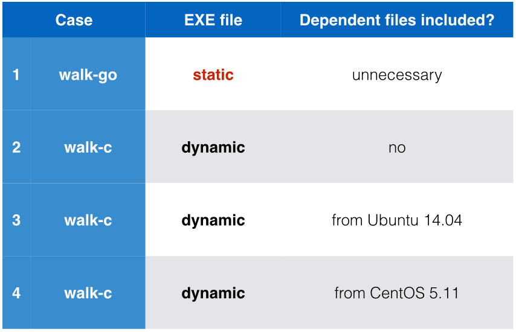

Several walk-tree examples
===

This directory demonstrates several Docker topics:

- Minimal Docker images (all less than 3 MB).

- Rootfs concept inside the Docker images/containers.

- Dependencies on runtime components (e.g., `.so` files).

- Isolation of resources.


## Main programs

The program “**walk**” tries to traverse directory structures starting from specified path (`.` by default). For brevity, it excludes `/dev`, `/proc`, and `/sys` directories from the output.


Two compiled versions of the same functionality written in C are provided:

1. Static version `walk-static`: a fully statically-linked ELF executable (i.e., without runtime dependencies on any `.so` files).


2. Dynamic version `walk-dynamic`: an ordinary ELF executabie with runtime dependencies on some system-wide `.so` files:

   ```bash
   $ ldd walk-dynamic
           linux-vdso.so.1 =>  (0x00007fff899f4000)
           libc.so.6 => /lib/x86_64-linux-gnu/libc.so.6 (0x00007f0e2a191000)
           /lib64/ld-linux-x86-64.so.2 (0x00007f0e2a55f000)
   ```

Refer to the `src` directory if you're courious about their C source code.





## Case 1: Fully statically-linked ELF file

The program `walk-static` is a fully statically-linked ELF executable.

★★ To build it into a minimal Docker image with `Dockerfile`:

```
$ docker build .
```

To see what's inside this image, starting from its root directory `/`:

```
$ docker run  IMAGE-ID  walk  /
```


## Case 2: Forget to link an ELF file with its dependent .so files

The program `walk-dynamic` is a dynamically-linked ELF executable with runtime dependencies on some system-wide `.so` files.

★★ To build it into a minimal Docker image with `Dockerfile`:

```
$ docker build .
```

To see what's inside this image, starting from its root directory `/` (**will fail!**):

```
$ docker run  IMAGE-ID  walk  /
```


## Case 3: Link with dependent .so files extracted from Ubuntu 14.04

Extract required `.so` files from Ubuntu 14.04:

   ```
    149120  Feb 25 2015  ld-linux-x86-64.so.2
   1840928  Feb 25 2015  libc.so.6
   ```

Then, pack them (together with `walk-dynamic`) into the tarball `rootfs-from-ubuntu1404.tar.gz`.


★★ To build it into a minimal Docker image with `Dockerfile`:

```
$ docker build .
```

To see what's inside this image, starting from its root directory `/`:

```
$ docker run  IMAGE-ID  walk  /
```


## Case 4: Link with dependent .so files extracted from CentOS 5.11

Extract required `.so` files from CentOS 5.11:

   ```
    142488  Sep 16 2014  ld-linux-x86-64.so.2
   1720712  Sep 16 2014  libc.so.6
   ```

Then, pack them (together with `walk-dynamic`) into the tarball `rootfs-from-centos511.tar.gz`.


★★ To build it into a minimal Docker image with `Dockerfile`:

```
$ docker build .
```

To see what's inside this image, starting from its root directory `/`:

```
$ docker run  IMAGE-ID  walk  /
```


## Thinking: possible collision?

System-wise `.so` files from Ubuntu 14.04:

   ```
    149120  Feb 25 2015  ld-linux-x86-64.so.2
   1840928  Feb 25 2015  libc.so.6
   ```

System-wise `.so` files from CentOS 5.11:

   ```
    142488  Sep 16 2014  ld-linux-x86-64.so.2
   1720712  Sep 16 2014  libc.so.6
   ```

Can these two suites co-exist at the same time?  Dependency hell?
