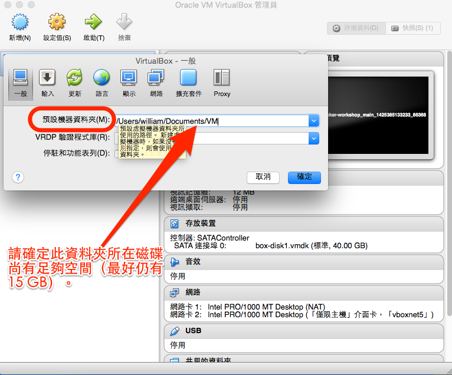

行前準備 Part 2：預載範例程式碼
===

[ <-- Prev: [行前準備 Part 1](prepare.md)  ]


為了節省課程現場下載程式及相關資源的時間及頻寬，請學員先在**網路暢通的地方**，根據指示備妥必要的軟體及設定。

整個過程可能會花上數十分鐘，請耐心等候。<br/>
整個過程可能會花上數十分鐘，請耐心等候。<br/>
整個過程可能會花上數十分鐘，請耐心等候。<br/>
（因為很重要，所以要說三次。）

&nbsp;

☛ 注意事項：

- 程式範例會在每一梯次開課前一週才定案，因此，建議**等開課前一週再進行下列步驟**。

- 進行以下步驟之前，請先確定 VirtualBox 之【預設機器資料夾】所在的磁碟上，仍有足夠空間，以容納各虛擬機內容及預載之 Docker 映像檔。建議至少要預留 15 GB：
  

- 進行以下步驟之前，建議您先關閉（甚至解除安裝）可能與 VirtualBox 相衝的其他虛擬機軟體。譬如說，以下命令可暫時關閉 Hyper-V（還需要你手動重新開機，才會生效）：

  ```
  bcdedit /set hypervisorlaunchtype off
  ```


&nbsp;


### 步驟一：Fork 本次 workshop 範例程式

1. 登入 GitHub 網站： https://github.com/

2. 開啟 https://github.com/William-Yeh/docker-workshop

3. 按右上角的  按鈕。

4. 幾秒鐘之內，你應該會被自動導引到自己帳號底下的 docker-workshop 專案。


### 步驟二：開啟終端機，以進行後續步驟

Linux 及 Mac 使用者：請使用 xterm、終端機 (Terminal)、iTerm 或任何你慣用的終端機軟體。

Windows 使用者：

1. 請先以「不含任何中文字」的使用者帳號，登入 Windows（否則會在某些 Vagrant 相關步驟出錯）。
2. 以『系統管理者』權限，打開【命令提示字元】軟體（否則**可能**會在某些 Vagrant 相關步驟出錯）。


### 步驟三：下載 workshop 範例程式

請先切換到你選定的工作目錄（Windows 用戶，請避免選用「含中文字」），譬如：

   ```shell
   cd YOUR_OWN_WORKING_DIRECTORY
   ```

再下載範例：

   ```shell
   git clone https://github.com/你的帳號/docker-workshop.git
   ```


### 步驟四：切換至此 workshop 目錄

```shell
cd docker-workshop
```

這個目錄，課堂上會反覆用到。建議你設桌面捷徑，以節省課堂現場切換目錄的時間。


#### ⇡ 以上所列的幾個步驟，如有不清楚的，請見示範錄影：

[](http://youtu.be/n2ogtWHZRzo)


### 步驟五：初始化 Vagrant 虛擬機

耗時最久的，就是這個步驟，請耐心等候。

- 如果你的電腦是 Mac 或 Linux，請輸入：

  ```shell
  ./setup-vagrant
  ```

- 如果你的電腦是 Windows，請輸入：

  ```shell
  setup-vagrant
  ```


### 步驟六：確認已設定完畢

輸入以下指令，查看各虛擬機的狀態：

```shell
vagrant status
```

如果看到以下畫面，三台虛擬機都呈現 "poweroff" 狀態，就表示已經順利設定完畢：

```
Current machine states:

main                      poweroff (virtualbox)
centos                    poweroff (virtualbox)
registry                  poweroff (virtualbox)

This environment represents multiple VMs. The VMs are all listed
above with their current state. For more information about a specific
VM, run `vagrant status NAME`.
```
