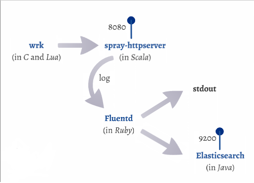

# Container Linking


This directory is to demonstrate the "[container linking](https://docs.docker.com/userguide/dockerlinks/)" feature of Docker, using [wrk](https://github.com/William-Yeh/docker-wrk) (written in C and Lua), [Spray](https://github.com/William-Yeh/Docker-Spray-HttpServer) (written in Scala), [Fluentd](https://github.com/William-Yeh/docker-fluentd) (written in Ruby), and [Elasticsearch + Kibana](http://www.elasticsearch.org/overview/kibana/) (written in Java) as example.




## Preparation

Prepare environments for experiment.

**CAUTION: This may take minutes. Do it at a place with good bandwidth.**

  ```
  $ docker pull williamyeh/wrk
  $ docker pull williamyeh/spray-httpserver
  $ docker pull williamyeh/fluentd
  $ docker pull digitalwonderland/elasticsearch
  ```


## Usage

1. Clear all unused container records:

   ```
   $ docker rm `docker ps --no-trunc -a -q`
   ```


2. Start the http server (with the container name `spray`):

   ```
   $ docker run -d --name spray  \
         williamyeh/spray-httpserver
   ```

3. Tail the logs of the http server, and keep this console open:

   ```
   $ docker logs -f spray
   ```

4. Open another console.  Use `wrk` to benchmark the http server:

   ```
   $ docker run --link spray:httpserver \
         williamyeh/wrk  http://httpserver:8080/
   ```


5. Use `wrk` to benchmark the http server, with random IPs as input:

   ```
   $ docker run --link spray:httpserver  \
         -v `pwd`:/data  \
         williamyeh/wrk  -s wrk-script.lua  http://httpserver:8080/
   ```


6. Generate Fluentd conf file `td-agent.conf` for capturing logs produced by the `spray` container:

   ```
   $ ./gen-fluentd-conf.sh  spray  > td-agent.conf
   ```


7. Use `fluentd` to collect the `spray` logs:

   ```
   $ docker run -it                 \
        -v /var/lib/docker/containers:/var/lib/docker/containers:ro  \
        -v `pwd`:/etc/td-agent:ro   \
        -v `pwd`:/data              \
        --net=host                  \
        williamyeh/fluentd  start
   ```


8. Re-run previous `wrk` task to see the `fluentd` output!


9. Start the `Elasticsearch` server:

   ```
   $ docker run -d  --name elasticsearch  \
         -p 9200:9200  \
         digitalwonderland/elasticsearch
   ```


10. Use browser to open the Kibana page:
    http://localhost:9200/_plugin/kibana3/


11. You may also re-run previous `wrk` task to see the Kibana dashboard!
