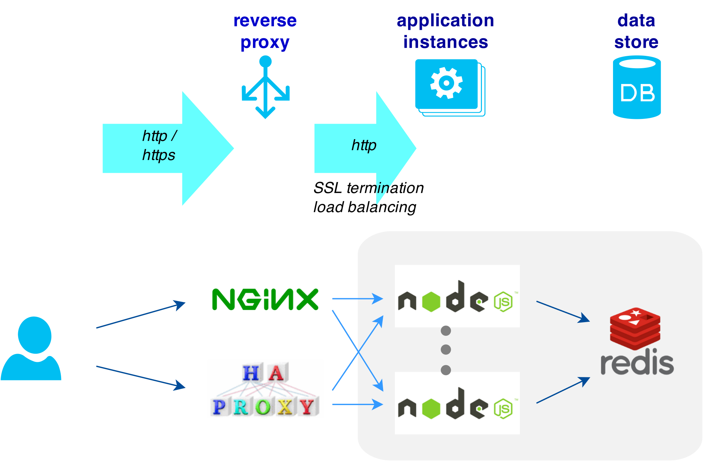

Reverse proxy + Docker example
===

## Purpose

Demonstrate how to use reverse proxy for backend application servers, all in the Docker's world.


## Software stack




#### Nginx

 - [Reverse proxy](http://nginx.com/resources/admin-guide/reverse-proxy/)

 - [Load balancing](http://nginx.com/resources/admin-guide/load-balancer/)

 - [SSL termination](http://nginx.com/resources/admin-guide/nginx-ssl-termination/): use `make-cert.sh` to generate self-signed certificate.


#### HAProxy

 - Reverse proxy

 - Load balancing

 - Active health monitoring

 - SSL termination: use `make-cert.sh` to generate self-signed certificate.


#### Node.js application server instances

 - Source code in `app` directory.
 - *N* instances.
 - High availability and zero-downtime deployments via Nginx or HAProxy.


#### Redis server

 - Shared datastore across all Node.js application instances.
 - [Persistence](http://redis.io/topics/persistence): RDB and AOF modes.


## Usage #1: simple case

First, start the whole software stack:

```bash
$ docker-compose up -d

$ docker ps
```


Second, connect to Nginx via HTTP and HTTPS :

```bash
$ curl -v http://localhost:10080

$ curl -v --insecure https://localhost:10443

```

Third, connect to HAProxy via HTTP and HTTPS :

```bash
$ curl -v http://localhost:10090

$ curl -v --insecure https://localhost:10091
```


## Usage #2: zero-downtime deployments

**NOTE**: Nginx supports "[`health_check`](http://nginx.com/resources/admin-guide/load-balancer/#health_active)" only in its commercial product "Nginx Plus" (see [this](http://nginx.org/en/docs/http/ngx_http_upstream_module.html#health_check) and [this](http://nginx.com/products/application-health-checks/)). Therefore, only HAProxy is demonstrated in this zero-downtime case.

First, start the whole software stack:

```bash
$ docker-compose -f docker-compose-2.yml up -d

$ docker ps
```

Second, use browser to open HAProxy statistics report: `http://localhost:10100/`


Third, connect to HAProxy via HTTP and HTTPS :

```bash
$ curl -v http://localhost/

$ curl -v --insecure https://localhost/
```


Fourth, stop one of the application instances (e.g., `app1`):

```bash
$ docker-compose stop app1
```

Then, try to connect via HTTP and HTTPS.  Any downtime?


Fifth, let the stopped instance come back to live:

```bash
$ docker-compose start app1
```

Then, try to connect via HTTP and HTTPS.  Does the instance recieve packets from HAProxy again?
