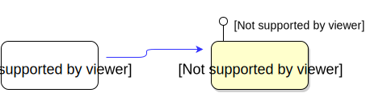
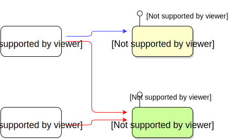
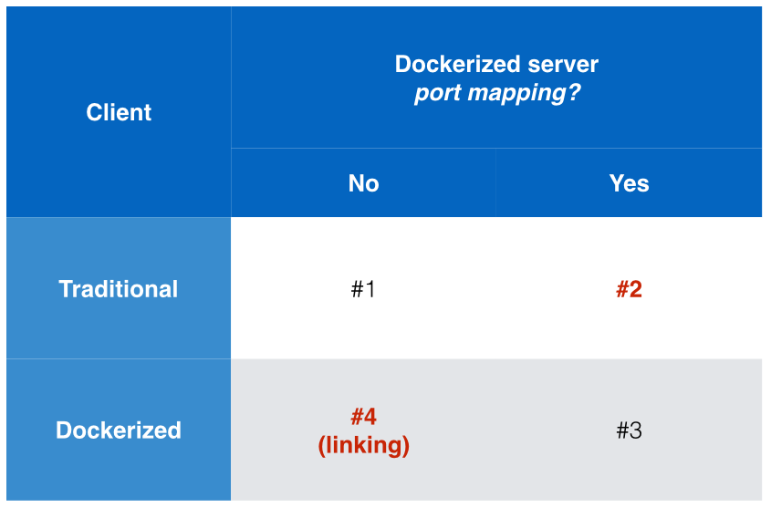
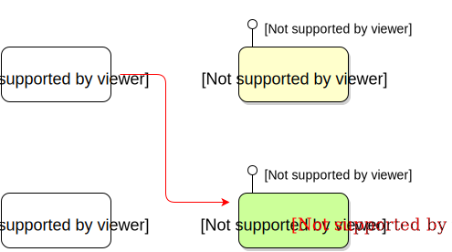
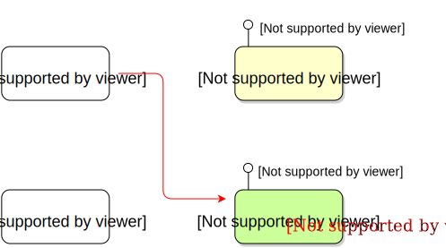
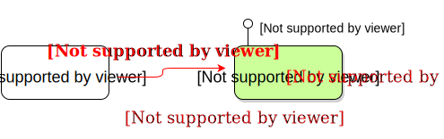

name: inverse
layout: true
class: center, middle, inverse

---

.percent120[.center[]]

# 從 API 角度思考／<br/>Container Linking

???

Img src: http://webblocks.co/dogfood

---

layout: false

# Lab setup

.pull-left[
## VMs

1. `main`:
   - `up`
   - `ssh`

2. `registry`:
   - `up`
]


.pull-right[
## Lab directory
- `build-redis-linking`
]


---

template: inverse

# Two dimensions of thinking...

---

class: center, middle

# Client software
## vs.
# Server software

---

class: center, middle

# Traditional software
## vs.
# Dockerized software


---

class: center, middle

.pull-left[
# Client
### - Traditional software
### - Dockerized software
]


.pull-right[
# Server
### - Traditional software
### - Dockerized software
]

---

class: code105

# Traditional scenario

.pull-right[
Native redis-server

```bash
$ sudo \
  service redis-server start
```
]

--

.pull-left[
Native redis-cli

```bash
$ IP=127.0.0.1
$ PORT=6379

$ redis-cli -h $IP -p $PORT

$ # ... or, simply:
$ redis-cli
```
]


.percent100[.right[]]

---

# What if... in the Docker world?

<br/>

.percent100[.center[]]

---

class: center, middle

.percent110[]


---


class: code110


# Scenario #1: without port mapping

.pull-right[
.red[Dockerized redis-server]

```bash
$ docker run -d    \
    --name redis1  \
    redis:2.8.19
```
]

--

.pull-left[
Native redis-cli

```bash
how?
```
]

.percent100[.right[]]


---

```
{
    "Bridge": "docker0",        ◀ virtual Ethernet bridge 'docker0'
    "Gateway": "172.17.42.1",   ◀ gateway of this bridge
    "IPAddress": "172.17.0.2",  ◀ container's IP within the bridge
    "Ports": {                  ◀ exposed ports?
      "6379/tcp": null
    }
}
```

.percent100[.right[]]

---

## ... Two approaches

1. `.NetworkSettings.IPAddress`

2. `--net=host`

.percent100[.right[]]


.footnote[.red[*] See Lab 8: [編譯示範／從源碼建 image](build-pl.html)
]

---

class: code110

# Scenario #2: .red[with] port mapping

.pull-right[
.red[Dockerized redis-server]

```bash
$ docker run -d    \
    -p 26379:6379  \
    --name redis2  \
    redis:2.8.19
```
]

--

.pull-left[
Native redis-cli

```bash
How?
```
]

.percent100[.right[]]


---

```
{
    "Bridge": "docker0",        ◀ 仍然在 bridge 'docker0' 裡面
    "Gateway": "172.17.42.1",
    "IPAddress": "172.17.0.3",  ◀ 仍然有獨立的 IP address
    "Ports": {
        "6379/tcp": [              ◀ container 內部的 6379 port...
          {
            "HostIp": "0.0.0.0",   ◀ ... 被 mapping 到外面的 0.0.0.0...
            "HostPort": "26379"    ◀ ... any interface 的 26379 port
          }
        ]
    }
}
```

.percent100[.right[]]


---

class: code110

# Scenario #3: .red[with] port mapping

.pull-right[
Dockerized redis-server

```bash
$ docker run -d    \
    --name redis2  \
    -p 26379:6379  \
    redis:2.8.19
```
]

--

.pull-left[
.red[Dockerized redis-cli]

```bash
How?
```
]

.percent100[.right[]]


---

```
{
    "Bridge": "docker0",        ◀ 仍然在 bridge 'docker0' 裡面
    "Gateway": "172.17.42.1",
    "IPAddress": "172.17.0.3",  ◀ 仍然有獨立的 IP address
    "Ports": {
        "6379/tcp": [              ◀ container 內部的 6379 port...
          {
            "HostIp": "0.0.0.0",   ◀ ... 被 mapping 到外面的 0.0.0.0...
            "HostPort": "26379"    ◀ ... any interface 的 26379 port
          }
        ]
    }
}
```

.percent100[.right[]]


---

```
{
    "Bridge": "docker0",        ◀ 仍然在 bridge 'docker0' 裡面
    "Gateway": "172.17.42.1",
    "IPAddress": "172.17.0.3",  ◀ 仍然有獨立的 IP address
    "Ports": {
        "6379/tcp": [              ◀ container 內部的 6379 port...
          {
*           "HostIp": "0.0.0.0",   ◀ ... 被 mapping 到外面的 0.0.0.0...
*           "HostPort": "26379"    ◀ ... any interface 的 26379 port
          }
        ]
    }
}
```


☛ Dockerized redis-cli:

```bash
$ IP=127.0.0.1
$ PORT=26379

$ # fail!!!
$ docker run -it redis:2.8.19  \
    redis-cli -h $IP -p $PORT
```
```
失敗：
Could not connect to Redis at 127.0.0.1:26379: Connection refused
```

---

Remember?
Docker's virtual Ethernet bridge

.percent100[.center[]]


.footnote[.red[*] Source: [Docker 源码分析（七）：Docker Container 网络（上）](http://blog.daocloud.io/docker-source-code-analysis-part7-first/)
]


---

```
{
    "Bridge": "docker0",        ◀ 仍然在 bridge 'docker0' 裡面
    "Gateway": "172.17.42.1",
*   "IPAddress": "172.17.0.3",  ◀ 仍然有獨立的 IP address
    "Ports": {
*       "6379/tcp": [              ◀ container 內部的 6379 port...
          {
            "HostIp": "0.0.0.0",   ◀ ... 被 mapping 到外面的 0.0.0.0...
            "HostPort": "26379"    ◀ ... any interface 的 26379 port
          }
        ]
    }
}
```

☛ Dockerized redis-cli:

```bash
$ IP=$(docker inspect  \
       --format "{{.NetworkSettings.IPAddress}}"  redis2)
$ PORT=6379

$ # fail!!!
$ docker run -it redis:2.8.19  \
    redis-cli -h $IP -p $PORT
```

--

<br/>
... manually lookup IP address; not perfect yet...


---

class: code110


# Scenario #4: .red[without] port mapping

.pull-right[
.red[Dockerized redis-server]

```bash
$ docker run -d    \
    --name redis1  \
    redis:2.8.19
```
]

--

.pull-left[
.red[Dockerized redis-cli]

```bash
how?
```
]

.percent100[.right[]]


---

```
{
    "Bridge": "docker0",        ◀ virtual Ethernet bridge 'docker0'
    "Gateway": "172.17.42.1",   ◀ gateway of this bridge
    "IPAddress": "172.17.0.2",  ◀ container's IP within the bridge
    "Ports": {                  ◀ exposed ports?
      "6379/tcp": null
    }
}
```

.percent100[.right[]]


---

class: center, middle

.percent110[]


---

class: code115

# 先從簡單的 busybox 下手...

.center[`--link  ` &nbsp;&nbsp; *target-name* `:` *alias*  ]

.pull-right[
Dockerized redis-server

```bash
$ docker run -d    \
    --name redis1  \
    redis:2.8.19
```
]

--

.pull-left[
.red[Dockerized *busybox*]

```bash
$ docker run -it         \
*   --link redis1:redis  \
    busybox
```
]

.percent100[.right[]]


---

template: inverse

# Container Linking

### env
### /etc/hosts


---

class: code120

## Use link to access it...

.right[`--link  ` &nbsp;&nbsp; *target-name* `:` *alias*  ]

- Invoke a busybox container to **link** to it...

  ```bash
  $ docker run -it  \
  *     --link redis1:redis \
        busybox
  ```

  Now, we're inside the busybox container, with a tty.

--

.pull-left[
- List environment variables in this busybox container:

  ```bash
  env
  ```
]

.pull-right[
- List `/etc/hosts` contents:

  ```bash
  cat /etc/hosts
  ```
]


---

# Env in this busybox container

Let's filter "`REDIS`" (in uppercase) patterns:

  ```bash
  env | grep REDIS
  ```
--
- networking info of the target container:

  ```
  REDIS_PORT=tcp://172.17.0.2:6379
  REDIS_PORT_6379_TCP_ADDR=172.17.0.2
  REDIS_PORT_6379_TCP_PORT=6379
  REDIS_PORT_6379_TCP_PROTO=tcp
  REDIS_PORT_6379_TCP=tcp://172.17.0.2:6379
  ```

--
- env of the target container:

  ```
  REDIS_ENV_REDIS_DOWNLOAD_URL=http://download.redis.io/releases/redis-2.8.19.tar.gz
  REDIS_ENV_REDIS_VERSION=2.8.19
  REDIS_ENV_REDIS_DOWNLOAD_SHA1=3e362f4770ac2fdbdce58a5aa951c1967e0facc8
  ```

--
- info of myself:

  ```
  REDIS_NAME=/prickly_perlman/redis
  ```


---

# `/etc/hosts` contents

  ```bash
  cat /etc/hosts
  ```
--
- networking info of the target container:

  ```
  172.17.0.2  redis
  ```
--
- myself (IPv4):

  ```
  172.17.0.4  6f9b745cf1ae
  127.0.0.1 localhost
  ```

--
- myself (IPv6):

  ```
  ::1 localhost ip6-localhost ip6-loopback
  fe00::0 ip6-localnet
  ff00::0 ip6-mcastprefix
  ff02::1 ip6-allnodes
  ff02::2 ip6-allrouters
  ```

---

## Link alias

.right[`--link  ` &nbsp;&nbsp; *target-name* `:` .red[*alias*]  ]

- Invoke a busybox container to **link** to it...

  ```bash
  $ docker run -it  \
  *     --link redis1:redis \
        busybox
  ```

  Inside the busybox container, we'll see:

--

.pull-left[
- Env (in uppercase):

  ```
  REDIS_PORT
  REDIS_PORT_6379_TCP
  REDIS_PORT_6379_TCP_*
  REDIS_ENV_*
  ```
]

.pull-right[
- `/etc/hosts`:

  ```
  xx.xx.xx.xx  redis
  ```
]

---

## What if we change the link's alias?

.right[`--link  ` &nbsp;&nbsp; *target-name* `:` .red[*alias*]  ]

- Invoke a busybox container to **link** to it...

  ```bash
  $ docker run -it  \
  *     --link redis1:redisserver \
        busybox
  ```

  Inside the busybox container, we'll see:

--

.pull-left[
- Env (in uppercase):

  ```
  REDISSERVER_PORT
  REDISSERVER_PORT_6379_TCP
  REDISSERVER_PORT_6379_TCP_*
  REDISSERVER_ENV_*
  ```
]

.pull-right[
- `/etc/hosts`:

  ```
  xx.xx.xx.xx  redisserver
  ```
]

---

## What if we change the link's target name?

.right[`--link  ` &nbsp;&nbsp; .red[*target-name*] `:` *alias*  ]

- Invoke a busybox container to **link** to another server container `redis2`...

  ```bash
  $ docker run -d --name redis2 redis:2.8.19

  $ docker run -it  \
  *     --link redis2:redis \
        busybox
  ```

  Inside the busybox container, we'll see:

--

.pull-left[
- Env (in uppercase):

  ```
  REDIS_PORT
  REDIS_PORT_6379_TCP
  REDIS_PORT_6379_TCP_*
  REDIS_ENV_*
  ```
]

.pull-right[
- `/etc/hosts`:

  ```
  xx.xx.xx.xx  redis
  ```
]

---

# Benefits of container linking

### Env and `/etc/hosts`
  - No need to lookup IP address manually
  - No need to specify port mapping manually

### Alias
  - Location transparency
  - Portable naming

---

class: center, middle

# OK, how can we connect to it?

--

.percent90[]

---

class: code115

# Scenario #4: .red[linking], without port mapping

.pull-right[
.red[Dockerized redis-server]

```bash
$ docker run -d    \
*   --name redis1  \
    redis:2.8.19
```
]

--

.pull-left[
.red[Dockerized redis-cli]

```bash
$ docker run -it        \
*   --link redis1:redis \
    redis:2.8.19        \
    \
    redis-cli  \
      -h redis -p 6379
```
]

--
<br clear="all">

.pull-right[
.red[Dockerized redis-server #2]

```bash
$ docker run -d    \
*   --name redis2  \
    redis:2.8.19
```
]

--

.pull-left[
.red[Dockerized redis-cli]

```bash
$ docker run -it        \
*   --link redis2:redis \
    redis:2.8.19        \
    \
    redis-cli  \
      -h redis -p 6379
```
]

---

class: code110


# 變與不變之間...

.pull-left[
Dockerized redis-cli

```bash
$ docker run -it          \
*   --link redis1:redis   \
    redis:2.8.19          \
    \
    redis-cli  \
      -h redis -p 6379
```

```bash
$ docker run -it          \
*   --link redis2:redis   \
    redis:2.8.19          \
    \
    redis-cli  \
      -h redis -p 6379
```
]

--

.pull-right[
Dockerized redis-cli

```bash
$ docker run -it          \
*   --link redis3:redis   \
    redis:2.8.19          \
    \
    redis-cli  \
      -h redis -p 6379
```

```bash
$ docker run -it          \
*   --link redis4:redis   \
    redis:2.8.19          \
    \
    redis-cli  \
      -h redis -p 6379
```
]

---

class: center, middle

### 不管 *target-name* 如何變動，
## 只要 link 的 .red[**alias**] 部分維持不變，<br/>`redis-cli` 的連線變數名稱就可維持不變。

<br/>

.percent100[]


---

template: inverse

# DRY (Don't Repeat Yourself)

## 如果某件事常常做，<br/>就值得單獨抽離出來。

---

class: code110

# Wrapper script for redis-cli

.pull-left[
- Dockerized redis-cli

```bash
$ docker run -it          \
*   --link redisXXX:redis \
    redis:2.8.19          \
    \
    redis-cli  \
      -h redis -p 6379
```

- Goal: wrapper

```bash
$ docker run -it          \
*   --link redisXXX:redis \
    redis:2.8.19          \
    \
    client
```
]


--

.pull-right[
☛ Wrapper for redis-cli

```bash
#!/bin/bash

exec redis-cli  \
      -h redis -p 6379
```
]


---

class: code110

# Wrapper script for redis-benchmark

.pull-left[
- Dockerized redis-benchmark

```bash
$ docker run -it          \
*   --link redisXXX:redis \
    redis:2.8.19          \
    \
    redis-benchmark  \
      -h redis -p 6379
```

- Goal: wrapper

```bash
$ docker run -it          \
*   --link redisXXX:redis \
    redis:2.8.19          \
    \
    benchmark
```
]


--

.pull-right[
☛ Wrapper for redis-benchmark

```bash
#!/bin/bash

exec redis-benchmark  \
      -h redis -p 6379
```
]


---

# Test them!

- Test in foreground:

  ```bash
  $ docker-compose up
  ```

--
  ... review the logs:

  ```bash
  $ docker logs `CONTAINER_NAME_OR_ID`
  ```

--

- Test in background:

  ```bash
  $ docker-compose up -d
  ```

--
  ... tail the logs:

  ```bash
  $ docker logs -f `CONTAINER_NAME_OR_ID`
  ```


---

# Benchmark our and official redis image?

```bash
$ docker-compose  -f docker-compose-mixed.yml  up
```

... and see the logs?

---

template: inverse

# Recap: API Thinking

---

## Various clients in the Docker world...

<br/>

.percent100[.center[]]

---

class: center, middle

.percent110[]


---

class: center, middle

# Questions?
