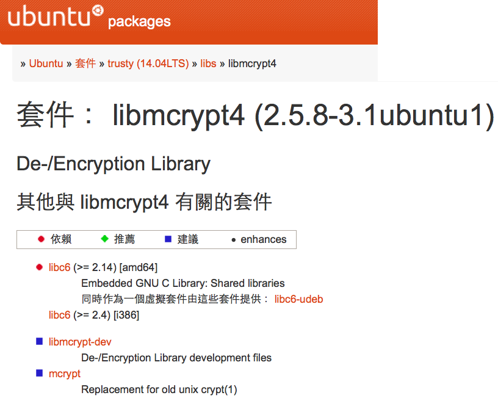

name: inverse
layout: true
class: center, middle, inverse

---

.percent80[.center[]]

# 進階示範／<br/>加解密程式 in PHP &amp; Node.js

???

Img src: http://zikayn.com/blog/wp-content/uploads/2011/12/monkey-5.jpg


---

layout: false

# Lab setup

.pull-left[
## VMs

1. `main`:
   - `up`
   - `ssh`

2. `registry`:
   - `up`
]


.pull-right[
## Lab directory
- `build-mcrypt`
]


---

template: inverse

# Task #1: PHP 加解密程式

---

class: center, middle

# PHP 加解密程式

## Block cipher - AES 256 + CBC mode

--

☛ Mcrypt: http://php.net/manual/en/book.mcrypt.php

---

class: center, middle

# Technical background

---

# Mcrypt dependencies

☛  [Requirements](http://php.net/manual/en/mcrypt.requirements.php)
  > "As of PHP 5.0.0 you will need `libmcrypt` Version 2.5.6 or greater."

☛  [Installation](http://php.net/manual/en/mcrypt.installation.php)
  > "You need to compile PHP with the `--with-mcrypt[=DIR]` parameter to enable this extension. DIR is the mcrypt install directory."

.footnote[.red[*] Source: http://php.net/manual/en/book.mcrypt.php]

---

# Components hierarchy


```
     +------------------------+
     |  App                   |
     +------------------------+

         +--------------------+
         |  PHP               |
         |  mcrypt extension  |
         +--------------------+

     +-------+       +-----------------+
     |  PHP  |       |  libmcrypt-dev  |
     |       |       |  libmcrypt      |
     +-------+       +-----------------+


     +---------------------------------+
     |  libc                           |
     +---------------------------------+

     +---------------------------------+
     |  root file system               |
     +---------------------------------+

     +---------------------------------+
     |  Linux kernel                   |
     +---------------------------------+
```


---

# Layer #1 - App source code

```
*    +------------------------+
*    |  App                   |
*    +------------------------+

         +--------------------+
         |  PHP               |
         |  mcrypt extension  |
         +--------------------+

     +-------+       +-----------------+
     |  PHP  |       |  libmcrypt-dev  |
     |       |       |  libmcrypt      |
     +-------+       +-----------------+


     +---------------------------------+
     |  libc                           |
     +---------------------------------+

     +---------------------------------+
     |  root file system               |
     +---------------------------------+

     +---------------------------------+
     |  Linux kernel                   |
     +---------------------------------+
```

---

# PHP mcrypt example


```php
define("CIPHER_ALGO", MCRYPT_RIJNDAEL_256);
//...

$iv_size = mcrypt_get_iv_size(CIPHER_ALGO, MCRYPT_MODE_CBC);
$iv = mcrypt_create_iv($iv_size, MCRYPT_RAND);
//...

$ciphertext = mcrypt_encrypt(CIPHER_ALGO, $key,
                             $plaintext, MCRYPT_MODE_CBC, $iv);
```

---

# Layer #2 - PHP extensions

```
     +------------------------+
     |  App                   |
     +------------------------+

*        +--------------------+
*        |  PHP               |
*        |  mcrypt extension  |
*        +--------------------+

     +-------+       +-----------------+
     |  PHP  |       |  libmcrypt-dev  |
     |       |       |  libmcrypt      |
     +-------+       +-----------------+


     +---------------------------------+
     |  libc                           |
     +---------------------------------+

     +---------------------------------+
     |  root file system               |
     +---------------------------------+

     +---------------------------------+
     |  Linux kernel                   |
     +---------------------------------+
```

---

# phpize

- [Compiling shared PECL extensions with `phpize`](http://php.net/manual/en/install.pecl.phpize.php)
  >  The `phpize` command is used to prepare the build environment for a PHP extension. In the following sample, the sources for an extension are in a directory named _extname_:

  ```bash
  $ cd extname
  $ phpize
  $ ./configure
  $ make
  # make install
  ```

- See also: https://github.com/docker-library/php/tree/master/5.6

---

# Layer #3 - libmcrypt

```
     +------------------------+
     |  App                   |
     +------------------------+

         +--------------------+
         |  PHP               |
         |  mcrypt extension  |
         +--------------------+

     +-------+       `+-----------------+`
     |  PHP  |       `|  libmcrypt-dev  |`
     |       |       `|  libmcrypt      |`
     +-------+       `+-----------------+`


     +---------------------------------+
     |  libc                           |
     +---------------------------------+

     +---------------------------------+
     |  root file system               |
     +---------------------------------+

     +---------------------------------+
     |  Linux kernel                   |
     +---------------------------------+
```

---


.percent100[.center[]]

???

See http://packages.ubuntu.com/trusty/libmcrypt4


---

# libmcrypt (2.5.8-3.1)

```bash
$ dpkg -c libmcrypt4_2.5.8-3.1_amd64.deb
```
```
drwxr-xr-x root/root       0 2009-11-05 19:32 ./
-rw-r--r-- root/root  187752 2009-11-05 19:32 ./usr/lib/libmcrypt.so.4.4.8
drwxr-xr-x root/root       0 2009-11-05 19:32 ./usr/share/doc/
[略]
lrwxrwxrwx root/root       0 2009-11-05 19:32 ./usr/lib/libmcrypt.so.4 -> libmcrypt.so.4.4.8
```


```bash
$ dpkg -c libmcrypt-dev_2.5.8-3.1_amd64.deb
```
```
drwxr-xr-x root/root       0 2009-11-05 19:32 ./
-rw-r--r-- root/root     800 2009-11-05 19:32 ./usr/lib/libmcrypt.la
-rw-r--r-- root/root  342244 2009-11-05 19:32 ./usr/lib/libmcrypt.a
-rw-r--r-- root/root    5260 2009-11-05 19:32 ./usr/include/mutils/mcrypt.h
-rw-r--r-- root/root      82 2009-11-05 19:32 ./usr/include/mcrypt.h
[略]
```

---

# Dependency management

## Install DEB file for libmcrypt

```bash
$ sudo dpkg -i libmcrypt-dev_2.5.8-3.1_amd64.deb
```
```
Unpacking libmcrypt-dev (2.5.8-3.1) ...
dpkg: dependency problems prevent configuration of libmcrypt-dev:
    libmcrypt-dev depends on libmcrypt4 (= 2.5.8-3.1); however:
        Package libmcrypt4 is not installed.

dpkg: error processing package libmcrypt-dev (--install):
    dependency problems - leaving unconfigured
Processing triggers for man-db (2.6.7.1-1) ...
Errors were encountered while processing:
    libmcrypt-dev
```

--

.footnote[.red[*] OS-level package management mechanisms (such as APT/YUM) will handle these dependencies automatically for you.]

---

class: center, middle

# Dependency

.percent120[.center[]]

---

# Packaging levels

- App source code level
- PL-level package manager
- OS-level package manager
- Docker
- Virtual machine


---


```
 +-----------------------+         |  +------------------------+
 |  App                  |         |  |  App                   |
 +-----------------------+         |  +------------------------+
                                   |
    +--------------------+         |      +-----------------------+
    |  PHP's             |         |      |  PL library/package/  |
    |  mcrypt extension  |         |      |  module/extension     |
    +--------------------+         |      +-----------------------+
                                   |
+-------+     +-----------------+  |  +---------+     +-----------------+
|  PHP  |     |  libmcrypt-dev  |  |  | PL      |     | special-purpose |
|       |     |  libmcrypt      |  |  | runtime |     | runtime lib     |
+-------+     +-----------------+  |  +---------+     +-----------------+
                                   |
                                   |
+-------------------------------+  |  +---------------------------------+
|  libc                         |  |  |  libc & generic runtime lib     |
+-------------------------------+  |  +---------------------------------+
                                   |
+-------------------------------+  |  +---------------------------------+
|  root file system             |  |  |  root file system               |
+-------------------------------+  |  +---------------------------------+
                                   |
+-------------------------------+  |  +---------------------------------+
|  Linux kernel                 |  |  |  Linux kernel                   |
+-------------------------------+  |  +---------------------------------+
```

---

## App source code level

```
 `+-----------------------+`         |  `+------------------------+`
 `|  App                  |`         |  `|  App                   |`
 `+-----------------------+`         |  `+------------------------+`
                                   |
    +--------------------+         |      +-----------------------+
    |  PHP's             |         |      |  PL library/package/  |
    |  mcrypt extension  |         |      |  module/extension     |
    +--------------------+         |      +-----------------------+
                                   |
+-------+     +-----------------+  |  +---------+     +-----------------+
|  PHP  |     |  libmcrypt-dev  |  |  | PL      |     | special-purpose |
|       |     |  libmcrypt      |  |  | runtime |     | runtime lib     |
+-------+     +-----------------+  |  +---------+     +-----------------+
                                   |
                                   |
+-------------------------------+  |  +---------------------------------+
|  libc                         |  |  |  libc & generic runtime lib     |
+-------------------------------+  |  +---------------------------------+
                                   |
+-------------------------------+  |  +---------------------------------+
|  root file system             |  |  |  root file system               |
+-------------------------------+  |  +---------------------------------+
                                   |
+-------------------------------+  |  +---------------------------------+
|  Linux kernel                 |  |  |  Linux kernel                   |
+-------------------------------+  |  +---------------------------------+
```


---

## PL-level package manager

```
 +-----------------------+         |  +------------------------+
 |  App                  |         |  |  App                   |
 +-----------------------+         |  +------------------------+
                                   |
    `+--------------------+`         |      `+-----------------------+`
    `|  PHP's             |`         |      `|  PL library/package/  |`
    `|  mcrypt extension  |`         |      `|  module/extension     |`
    `+--------------------+`         |      `+-----------------------+`
                                   |
+-------+     +-----------------+  |  +---------+     +-----------------+
|  PHP  |     |  libmcrypt-dev  |  |  | PL      |     | special-purpose |
|       |     |  libmcrypt      |  |  | runtime |     | runtime lib     |
+-------+     +-----------------+  |  +---------+     +-----------------+
                                   |
                                   |
+-------------------------------+  |  +---------------------------------+
|  libc                         |  |  |  libc & generic runtime lib     |
+-------------------------------+  |  +---------------------------------+
                                   |
+-------------------------------+  |  +---------------------------------+
|  root file system             |  |  |  root file system               |
+-------------------------------+  |  +---------------------------------+
                                   |
+-------------------------------+  |  +---------------------------------+
|  Linux kernel                 |  |  |  Linux kernel                   |
+-------------------------------+  |  +---------------------------------+
```


---

## OS-level package manager

```
 +-----------------------+         |  +------------------------+
 |  App                  |         |  |  App                   |
 +-----------------------+         |  +------------------------+
                                   |
    +--------------------+         |      +-----------------------+
    |  PHP's             |         |      |  PL library/package/  |
    |  mcrypt extension  |         |      |  module/extension     |
    +--------------------+         |      +-----------------------+
                                   |
+-------+     `+-----------------+`  |  +---------+     `+-----------------+`
|  PHP  |     `|  libmcrypt-dev  |`  |  | PL      |     `| special-purpose |`
|       |     `|  libmcrypt      |`  |  | runtime |     `| runtime lib     |`
+-------+     `+-----------------+`  |  +---------+     `+-----------------+`
                                   |
                                   |
+-------------------------------+  |  +---------------------------------+
|  libc                         |  |  |  libc & generic runtime lib     |
+-------------------------------+  |  +---------------------------------+
                                   |
+-------------------------------+  |  +---------------------------------+
|  root file system             |  |  |  root file system               |
+-------------------------------+  |  +---------------------------------+
                                   |
+-------------------------------+  |  +---------------------------------+
|  Linux kernel                 |  |  |  Linux kernel                   |
+-------------------------------+  |  +---------------------------------+
```


---

## Virtual machine


```
*     +------------------------+
*     |  App                   |
*     +------------------------+

*         +----------------------+
*         |  PL library/package/ |
*         |  module/extension    |
*         +----------------------+

*     +---------+     +-----------------+
*     | PL      |     | special-purpose |
*     | runtime |     | runtime lib     |
*     +---------+     +-----------------+

*     +---------------------------------+
*     |  libc & generic runtime lib     |
*     +---------------------------------+

*     +---------------------------------+
*     |  root file system               |
*     +---------------------------------+

*     +---------------------------------+
*     |  Linux kernel                   |
*     +---------------------------------+
```


---

.pull-left[
## VM
]

.pull-right[
## Docker
]
<br clear="all">

```
 `+------------------------+`         |  `+------------------------+`
 `|  App                   |`         |  `|  App                   |`
 `+------------------------+`         |  `+------------------------+`

     `+----------------------+`       |      `+----------------------+`
     `|  PL library/package/ |`       |      `|  PL library/package/ |`
     `|  module/extension    |`       |      `|  module/extension    |`
     `+----------------------+`       |      `+----------------------+`

 `+---------+`   `+-----------------+`  |  `+---------+`   `+-----------------+`
 `| PL      |`   `| special-purpose |`  |  `| PL      |`   `| special-purpose |`
 `| runtime |`   `| runtime lib     |`  |  `| runtime |`   `| runtime lib     |`
 `+---------+`   `+-----------------+`  |  `+---------+`   `+-----------------+`

 `+-------------------------------+`  |  `+-------------------------------+`
 `|  libc & generic runtime lib   |`  |  `|  libc & generic runtime lib   |`
 `+-------------------------------+`  |  `+-------------------------------+`

 `+-------------------------------+`  |  `+-------------------------------+`
 `|  root file system             |`  |  `|  root file system             |`
 `+-------------------------------+`  |  `+-------------------------------+`

 `+-------------------------------+`  |  +-------------------------------+
 `|  Linux kernel                 |`  |  |  Linux kernel ≥ 3.10          |
 `+-------------------------------+`  |  +-------------------------------+
```

---

# Build it with Docker!

```bash
$ docker build  \
      -f Dockerfile.php  \    ◀ Docker 1.5.0 新增選項
      .                       ◀ 別忘了這個！
```

.percent50[.right[]]


---

# Look what we've built...


```bash
$ docker images
```

.footnote[.red[*] See the _very very very ugly_ ID?]

Or,

```bash
$ docker images --tree
```

---

# 收割時刻：Run it!

  ```bash
  $ cat example.php  |  docker run -i  `IMAGE_ID_OR_NAME`
  ```

--
> ... or, wrapper script:
>
  ```bash
  $ ./demo-php  `IMAGE_ID_OR_NAME`
  ```


.footnote[.red[*] The `-i` option: "Keep STDIN open (even if not attached)."]

---

# Check if all dependencies are packaged into the image...

--

- The image's Dockerfile has specified a default `ENTRYPOINT`:

  ```docker
  ...
  ENTRYPOINT [ "php" ]
  ```

--

- So we have to override this with `bash` at runtime:

  ```bash
  $ docker run -it  \
        --entrypoint="bash"  \
        `IMAGE_ID_OR_NAME`
  ```

--

- ... or, more directly:

  ```bash
  $ docker run -it  \
        --entrypoint="bash"  \
        `IMAGE_ID_OR_NAME`     \
            -c "ls -al /usr/lib/libmcrypt*"
  ```

---

template: inverse

# Task #2: Node.js 加解密程式

---

class: center, middle

# Node.js 加解密程式

## Block cipher - AES 256 + CBC mode

--

☛ Mcrypt: https://www.npmjs.com/package/mcrypt

---

class: center, middle

# Technical background

---

# Mcrypt dependencies

☛  Debian / Ubuntu
  > `apt-get install libmcrypt4 libmcrypt-dev`

☛  Install
  > `npm install mcrypt`

.footnote[.red[*] Source: https://www.npmjs.com/package/mcrypt]

---

# Components hierarchy


```
     +------------------------+
     |  App                   |
     +------------------------+

         +--------------------+
         |  Node.js           |
         |  mcrypt module     |
         +--------------------+

     +---------+     +-----------------+
     | Node.js |     |  libmcrypt-dev  |
     |         |     |  libmcrypt      |
     +---------+     +-----------------+


     +---------------------------------+
     |  libc                           |
     +---------------------------------+

     +---------------------------------+
     |  root file system               |
     +---------------------------------+

     +---------------------------------+
     |  Linux kernel                   |
     +---------------------------------+
```


---

# Layer #1 - App source code

```
*    +------------------------+
*    |  App                   |
*    +------------------------+

         +--------------------+
         |  Node.js           |
         |  mcrypt module     |
         +--------------------+

     +---------+     +-----------------+
     | Node.js |     |  libmcrypt-dev  |
     |         |     |  libmcrypt      |
     +---------+     +-----------------+


     +---------------------------------+
     |  libc                           |
     +---------------------------------+

     +---------------------------------+
     |  root file system               |
     +---------------------------------+

     +---------------------------------+
     |  Linux kernel                   |
     +---------------------------------+

```

---

# Node.js mcrypt example


```php
var mcrypt = require('mcrypt');

var CIPHER_ALGO = 'rijndael-256';
var cipher = new mcrypt.MCrypt(CIPHER_ALGO, 'cbc');
//...

var iv = cipher.generateIv();
var iv_size = iv.length;
//...

cipher.open(key, iv);
var ciphertext = cipher.encrypt(plaintext);
```

---

# Layer #2 - Node.js modules

```
     +------------------------+
     |  App                   |
     +------------------------+

*        +--------------------+
*        |  Node.js           |
*        |  mcrypt module     |
*        +--------------------+

     +---------+     +-----------------+
     | Node.js |     |  libmcrypt-dev  |
     |         |     |  libmcrypt      |
     +---------+     +-----------------+


     +---------------------------------+
     |  libc                           |
     +---------------------------------+

     +---------------------------------+
     |  root file system               |
     +---------------------------------+

     +---------------------------------+
     |  Linux kernel                   |
     +---------------------------------+

```

---

# NPM (Node.js Package Manager)

- List modules to be used in `package.json`:

  ```json
  {
      //...
      "dependencies": {
          "mcrypt": "*"
      }
  }
  ```

- Install modules with `npm`:

  ```bash
  $ npm install
  ```


.footnote[See also: [Dockerfile of `node/0.10.36-onbuild`](https://github.com/joyent/docker-node/blob/d23f190e500e91ecc636878a079ff971b29eab3e/0.10/onbuild/Dockerfile)
]

---

# Layer #3 - libmcrypt

```
     +------------------------+
     |  App                   |
     +------------------------+

         +--------------------+
         |  Node.js           |
         |  mcrypt module     |
         +--------------------+

     +---------+     `+-----------------+`
     | Node.js |     `|  libmcrypt-dev  |`
     |         |     `|  libmcrypt      |`
     +---------+     `+-----------------+`


     +---------------------------------+
     |  libc                           |
     +---------------------------------+

     +---------------------------------+
     |  root file system               |
     +---------------------------------+

     +---------------------------------+
     |  Linux kernel                   |
     +---------------------------------+
```

---

# libmcrypt (~~2.5.8-3.1~~) (2.5.8-3.3)

```bash
$ dpkg -c libmcrypt4_2.5.8-3.3_amd64.deb
```
```
drwxr-xr-x root/root       0 2014-09-28 16:50 ./
-rw-r--r-- root/root  187920 2014-09-28 16:50 ./usr/lib/libmcrypt.so.4.4.8
drwxr-xr-x root/root       0 2014-09-28 16:50 ./usr/share/doc/
[略]
lrwxrwxrwx root/root       0 2014-09-28 16:50 ./usr/lib/libmcrypt.so.4 -> libmcrypt.so.4.4.8
```


```bash
$ dpkg -c libmcrypt-dev_2.5.8-3.3_amd64.deb
```
```
drwxr-xr-x root/root       0 2014-09-28 16:50 ./
-rw-r--r-- root/root     950 2014-09-28 16:50 ./usr/lib/libmcrypt.la
-rw-r--r-- root/root  342162 2014-09-28 16:50 ./usr/lib/libmcrypt.a
-rw-r--r-- root/root      82 2014-09-28 16:50 ./usr/include/mcrypt.h
-rw-r--r-- root/root    5260 2014-09-28 16:50 ./usr/include/mutils/mcrypt.h
[略]
```

---

# Quiz

Given a `Dockerfile.nodejs`, do the following on your own:


- Build it with Docker!
- Run it!
- Check if all dependencies are packaged into the image...

---

template: inverse

## Recap:
# Dependency Hell?

---

# Dependency hell... in Docker?

- 2.5.8-3.1 (in PHP example)

```
187752  2009-11-05 19:32  /usr/lib/libmcrypt.so.4.4.8
   800  2009-11-05 19:32  /usr/lib/libmcrypt.la
342244  2009-11-05 19:32  /usr/lib/libmcrypt.a
    82  2009-11-05 19:32  /usr/include/mcrypt.h
  5260  2009-11-05 19:32  /usr/include/mutils/mcrypt.h
```

- 2.5.8-3.3 (in Node.js example)

```
187920  2014-09-28 16:50  /usr/lib/libmcrypt.so.4.4.8
   950  2014-09-28 16:50  /usr/lib/libmcrypt.la
342162  2014-09-28 16:50  /usr/lib/libmcrypt.a
    82  2014-09-28 16:50  /usr/include/mcrypt.h
  5260  2014-09-28 16:50  /usr/include/mutils/mcrypt.h
```

---

class: center, middle

.percent90[.center[]]

---

class: center, middle

# Questions?
