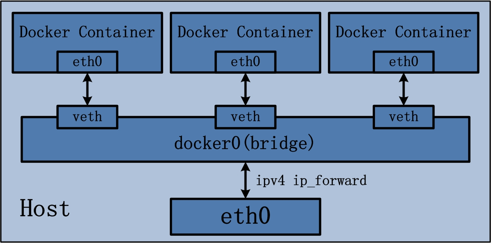
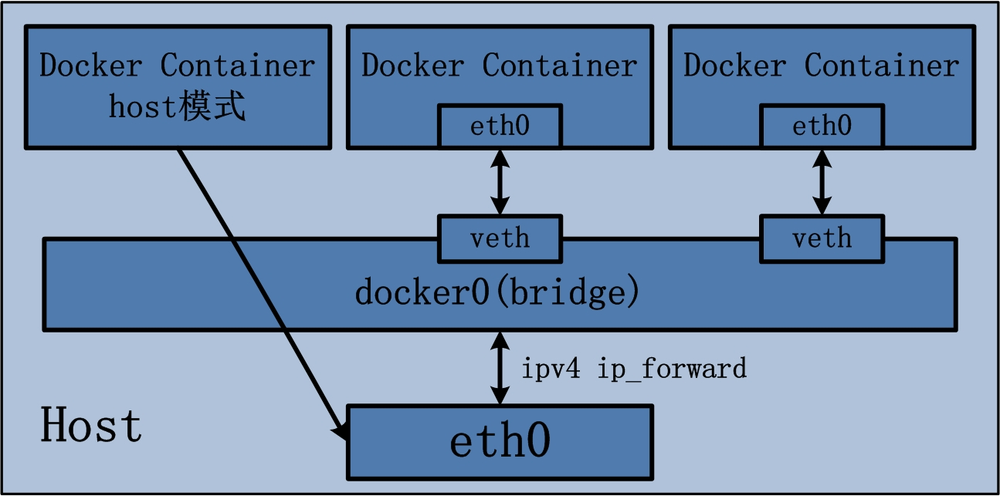

name: inverse
layout: true
class: center, middle, inverse

---

.percent80[.center[]]

# 編譯示範／從源碼建 image

???

Img src: http://www.vectorstock.com/royalty-free-vector/cook-vector-684665

---

layout: false

# Lab setup

.pull-left[
## VMs

1. `main`:
   - `up`
   - `ssh`

2. `registry`:
   - `up`
]


.pull-right[
## Lab directory
- `build-chat`
]

---

# 這次沒有 DEB 或 RPM 了...


```bash
$ tree
.
├── ABOUT-THIS-PATCH.md
├── Dockerfile
├── README.md
├── index.html
├── index.js
└── package.json
```

--

### 可是，有 Node.js 程式碼檔案，

### ... 還有 dependency 設定...

---

# Dependencies

`package.json`:

```json
{
    "name": "socket-chat-example",
    "version": "0.0.1",
    "description": "my first socket.io app",
    "scripts": {
        "start": "node index.js"
    },
    "dependencies": {
        "express": "4.10.2",
        "socket.io": "1.2.0"
    }
}
```

---

template: inverse

## ☛ II. Dependencies
Explicitly declare and isolate dependencies

.footnote[.red[*] See "[12 Factor App](http://12factor.net/)"
]

---

# Dockerfile

## "Makefile" for Docker images

.percent50[.right[]]

---

# Dockerfile for this chat server

```dockerfile
FROM  node:0.10.36-slim

RUN      mkdir -p /app
WORKDIR  /app

COPY     package.json  /app/
RUN      npm install --production
COPY     .  /app

EXPOSE   3000
CMD      [ "npm", "start" ]
```

.footnote[.red[☛] Open 〈[Dockerfile 指令](http://philipzheng.gitbooks.io/docker_practice/content/dockerfile/instructions.html)〉 and "[Dockerfile Reference](https://docs.docker.com/reference/builder/)" side by side for your easy reference.]

---

# 逐行拆解 Dockerfile 指令

## #1: Base image

```dockerfile
FROM  node:0.10.36-slim
```

.footnote[.red[*] Docker Hub: https://registry.hub.docker.com/_/node/ ]

--

Remember image hierarchy?

```bash
$ docker images --tree
```

---

# 逐行拆解 Dockerfile 指令

## #2: prepare directory inside the image

```dockerfile
# 建新目錄
RUN      mkdir -p /app

# 設定：以下各行的 Dockerfile 命令，皆以此為工作目錄
WORKDIR  /app
```

--

也可依循傳統 Linux 慣例，把軟體安裝在 image 裡面的 `/usr/local` 或 `/opt` 等處。

---

# 逐行拆解 Dockerfile 指令

## #3: Add something to target image

```dockerfile
COPY  package.json  /app/
```

.percent50[.center[]]


???

Img src: http://www.vectorstock.com/royalty-free-vector/cook-vector-684665

---

# 逐行拆解 Dockerfile 指令

## #4: Run commands within target image

```dockerfile
#--  install dependencies from Nodejs NPM system
RUN  npm install --production
```

.percent50[.center[]]


???

Img src: http://www.vectorstock.com/royalty-free-vector/cook-vector-684665


---

# 逐行拆解 Dockerfile 指令

## #5: Ports to be exposed


```dockerfile
EXPOSE  3000
```

.footnote[.red[*] Good practice: Treat Dockerfile as a spec.]

--

<br/>

- TCP port 3000 is defined in `index.js`:

  ```javascript
  http.listen(3000, function(){ /*... */ });
  ```

---

# 逐行拆解 Dockerfile 指令

## #6: Default start cmd for the target image

```dockerfile
# start chat server
CMD  [ "npm", "start" ]
```

.footnote[.red[*] In this case, `/usr/local/bin/npm` <br/> as provided from the base image `node:0.10.36-slim`.]

---

# Build it!

```bash
$ docker build .
```

.percent50[.right[]]


---

# Look what we've built...


```bash
$ docker images
```

Or,

```bash
$ docker images --tree
```

---

# 收割時刻：Run it!

Foreground mode:

```bash
$ docker run  `IMAGE_ID_OR_NAME`
```

<br/>
**Ctrl-C** to stop.


---

# 收割時刻：Run it!

Background mode (_**d**aemon_ mode):

```bash
$ docker run -d  `IMAGE_ID_OR_NAME`
```

--

Is it running?

```bash
# process?
$ ps aux | grep node

# current status
$ docker ps
```

---

# Try to connect to it?

```bash
$ curl http://localhost:3000
curl: (7) Failed to connect to localhost port 3000: Connection refused


$ curl http://127.0.0.1:3000
curl: (7) Failed to connect to 127.0.0.1 port 3000: Connection refused
```

<br/>

.percent70[.center[]]

???

Img src: http://i1.w.hjfile.cn/doc/201011/orz42797.jpg

---

template: inverse

# Docker networking models

### Devils in the Detail...

---

# Devils in the Detail...

Low-level information on a container or image

```bash
Usage: docker inspect [OPTIONS] CONTAINER|IMAGE [CONTAINER|IMAGE...]

Return low-level information on a container or image

  -f, --format=""    Format the output using the given go template.
```

.footnote[.red[*] See [official docker cli reference](https://docs.docker.com/reference/commandline/cli/#inspect) for more details.]

--

- Try!

  ```bash
  $ # which container id/name?
  $ docker ps

  $ docker inspect  `CONTAINER_ID_OR_NAME`
  ```

---

# Container's network settings (1/2)

- Look at the `.NetworkSettings` part:

  ```bash
  $ docker inspect  \
        --format '{{ .NetworkSettings }}'  \
        `CONTAINER_ID_OR_NAME`
  ```

--

- ... or, use `jq` .red[*] to pretty-print the JSON content:

  ```bash
  $ docker inspect  `CONTAINER_ID_OR_NAME`  \
        |  jq '.[] | .NetworkSettings'
  ```


.footnote[.red[*] [jq](http://stedolan.github.io/jq/) is a lightweight and flexible command-line JSON processor.
]


---

# Container's network settings (2/2)

Sample output of `.NetworkSettings`:

```json
{
    "Bridge": "docker0",        ◀◀◀◀◀◀◀◀ 注意這個！
    "Gateway": "172.17.42.1",   ◀◀◀◀◀◀◀◀ 注意這個！
    "GlobalIPv6Address": "",
    "GlobalIPv6PrefixLen": 0,
    "IPAddress": "172.17.0.2",  ◀◀◀◀◀◀◀◀ 注意這個！
    "IPPrefixLen": 16,
    "IPv6Gateway": "",
    "LinkLocalIPv6Address": "fe80::42:acff:fe11:2",
    "LinkLocalIPv6PrefixLen": 64,
    "MacAddress": "02:42:ac:11:00:02",
    "PortMapping": null,
    "Ports": {                  ◀◀◀◀◀◀◀◀ 注意這個！
      "3000/tcp": null
    }
}
```

---

# Docker's virtual Ethernet bridge

Interesting subset of `.NetworkSettings`:

```json
"Bridge": "docker0",        ◀ virtual Ethernet bridge 'docker0'
"Gateway": "172.17.42.1",   ◀ gateway of this bridge
"IPAddress": "172.17.0.2",  ◀ container's IP within the bridge
"Ports": {                  ◀ exposed ports?
  "3000/tcp": null
}
```

--
- Compare with `ifconfig` and `iptables` info:

  ```bash
  $ ifconfig
  docker0   Link encap:Ethernet  HWaddr 56:84:7a:fe:97:99
            inet addr:172.17.42.1  Bcast:0.0.0.0  Mask:255.255.0.0
            [...]

  $ ip addr
  $ sudo iptables -L -n
  $ sudo iptables-save
  ```

---

class: center, middle

.percent100[.center[]]


.footnote[.red[*] Source: [Docker 源码分析（七）：Docker Container 网络（上）](http://blog.daocloud.io/docker-source-code-analysis-part7-first/)
]

---

# What Docker official document said...

> When Docker starts, it creates a virtual interface named `docker0` on the host machine.
> It randomly chooses an address and subnet from the private range defined by RFC 1918 that are not in use on the host machine, and assigns it to `docker0`.

> ... But `docker0` is no ordinary interface. It is a virtual *Ethernet bridge* that automatically forwards packets between any other network interfaces that are attached to it.


.footnote[Source: [Advanced networking](https://docs.docker.com/articles/networking/) at Docker.com
]

---

# Can we try to connect to it, now?

--
1. Find out the container's IP .red[*] :

   ```bash
   $ C_IP=$(docker inspect  \
        --format '{{ .NetworkSettings.IPAddress }}'  \
        `CONTAINER_ID_OR_NAME`)
   ```
.footnote[.red[*] Or, use my wrapper `docker-inspect-attr`; see [William-Yeh/docker-host-tools](https://github.com/William-Yeh/docker-host-tools) at GitHub.
]

--
2. Connect using the inspected IP address:

   ```bash
   $ curl http://$C_IP:3000
   ```

<br/>
... manually lookup; not perfect yet...


---

# Can we skip this bridge stuff?

--

1. Use `--net=host` to tell Docker *not* to containerize the container's networking:

   ```bash
   $ docker run -d   \
         --net=host  \
         `IMAGE_ID_OR_NAME`
   ```

--
   ☛ Check: is the container within the `docker0` bridge?

   ```bash
   $ docker inspect  `CONTAINER_ID_OR_NAME`  \
         |  jq '.[] | .NetworkSettings'
   ```

--
2. Now, we can connect to it as usual `localhost`!

   ```bash
   $ curl http://localhost:3000
   ```

---

class: center, middle

.percent100[.center[]]


.footnote[.red[*] Source: [Docker 源码分析（七）：Docker Container 网络（上）](http://blog.daocloud.io/docker-source-code-analysis-part7-first/)
]

---

# Review of the 2 approaches

.pull-left[
`.NetworkSettings.IPAddress`

- Pros
  - Isolated networking

- Cons
  - Not so simple
  - Details have to be exposed
]

.pull-right[
`--net=host`

- Pros
  - Simple

- Cons
  - Non-isolated networking
  - Risk: port conflicts
]


---

# What if...?

.pull-left[

- Pros
  - Isolated networking

- Cons
  - ~~Not so simple~~
  - ~~Details have to be exposed~~
]

.pull-right[

- Pros
  - Simple

- Cons
  - ~~Non-isolated networking~~
  - ~~Risk: port conflicts~~
]

---

template: inverse

# Port mapping


---

# Re-run with port mapping...

```bash
$ docker run -d   -p 10080:3000   `IMAGE_ID_OR_NAME`
```

--

- 檢查看看 port mapping 是否生效...

  ```bash
  $ docker inspect  `CONTAINER_ID_OR_NAME`  \
        |  jq '.[] | .NetworkSettings'
  ```

  摘錄：

  ```json
  "Bridge": "docker0",        ◀ 仍然在 bridge 'docker0' 裡面
  "Gateway": "172.17.42.1",
  "IPAddress": "172.17.0.3",  ◀ 仍然有獨立的 IP address
  "Ports": {
    "3000/tcp": [            ◀ container 內部的 3000 port...
      {
        "HostIp": "0.0.0.0", ◀ ... 被 mapping 到外面的 0.0.0.0...
        "HostPort": "10080"  ◀ ... any interface 的 10080 port
      }
    ]
  ```


---

# 其他檢查 port mappings 的方法

1. 看 container 列表：

   ```bash
   $ docker ps
   ```
--
2. 用 `docker port` 指令：

    ```bash
    $ docker port

    Usage: docker port CONTAINER [PRIVATE_PORT[/PROTO]]

    List port mappings for the CONTAINER,
    or lookup the public-facing port
                  that is NAT-ed to the PRIVATE_PORT
    ```

    - 實例：

      ```bash
      $ docker port  `CONTAINER_ID_OR_NAME`
      3000/tcp -> 0.0.0.0:10080
      ```

---

# 試著連線看看...

```bash
$ curl http://127.0.0.1:10080
```

---

class: center, middle

# 用瀏覽器玩玩看吧...

.percent90[
]

---

# Quiz

這次的 Dockerfile 有一個地方用途重疊。

請設法找出，修改，並以這個修正版重新執行。

```dockerfile
FROM  node:0.10.36-slim

RUN      mkdir -p /app
WORKDIR  /app

COPY     package.json  /app/
RUN      npm install --production
COPY     .  /app

EXPOSE   3000
CMD      [ "npm", "start" ]
```

---

template: inverse

# Appendix A: Docker Compose

### was: Fig

.footnote[.red[*] https://github.com/docker/compose ]

---

# Service definition file

`docker-compose.yml`:


```yaml
app:
  build: .
  ports:
    - "10080:3000"
```


---

# Run it!

## Foreground mode

```bash
$ docker-compose  up
```

## Background mode

```bash
$ docker-compose  up  -d
```


---

template: inverse

# Appendix B: 其他語言？

### Java
### PHP
### Python
### Ruby

---

# 其他語言？

## Java: maven

例子：[`maven`](https://registry.hub.docker.com/_/maven/) 的 [Dockerfile](https://github.com/carlossg/docker-maven/blob/b022df671b603a9100ed9e75803ae32f753826a4/jdk-8/onbuild/Dockerfile):

```dockerfile
FROM  maven:3-jdk-8

RUN      mkdir -p /usr/src/app
WORKDIR  /usr/src/app

ONBUILD  ADD  .  /usr/src/app

ONBUILD  RUN  mvn install
```

---

# 其他語言？

## Java: gradle

例子：[`williamyeh/cseg`](https://registry.hub.docker.com/u/williamyeh/cseg/) 的 [Dockerfile](https://github.com/William-Yeh/cseg/blob/master/docker/Dockerfile):

```dockerfile
...

ENV GRADLE_BIN  /tmp/gradle-2.0/bin/gradle
...

$GRADLE_BIN download  && \
$GRADLE_BIN build     && \
...
```

---

# 其他語言？

## PHP: Composer

例子：[`tutum/apache-php`](https://registry.hub.docker.com/u/tutum/apache-php/) 的:

```dockerfile
...

RUN composer install

...
```

---

# 其他語言？

## Python: pip

例子：官方版 [`registry`](https://registry.hub.docker.com/_/registry/) 的 [Dockerfile](https://github.com/docker/docker-registry/blob/master/Dockerfile)：

```dockerfile
...

# Install core
RUN pip install /docker-registry/depends/docker-registry-core

# Install registry
RUN pip install file:///docker-registry#egg=docker-registry[bugsnag,newrelic,cors]

...
```

---

# 其他語言？

## Python: pip

例子：官方版 [`docker compose`](https://github.com/docker/compose) 的 [Dockerfile](https://github.com/docker/compose/blob/master/Dockerfile)：

```dockerfile
...

WORKDIR /code/

ADD requirements.txt      /code/
RUN pip install -r requirements.txt

ADD requirements-dev.txt  /code/
RUN pip install -r requirements-dev.txt

...
```

---

# 其他語言？

## Ruby: gem

例子：[`williamyeh/fluentd`](https://registry.hub.docker.com/u/williamyeh/fluentd/) 的 [Dockerfile](https://github.com/William-Yeh/docker-fluentd/blob/master/Dockerfile)：

```dockerfile
...

ENV EMBEDDED_BIN  /opt/td-agent/embedded/bin
ENV FLUENT_GEM    $EMBEDDED_BIN/fluent-gem
...

$FLUENT_GEM install \
        fluent-plugin-secure-forward  \
        fluent-plugin-watch-process   \
        fluent-plugin-multiprocess    \
        fluent-plugin-docker-metrics  \
        fluent-plugin-elasticsearch   \
        fluent-plugin-kafka           \
        --no-rdoc --no-ri  && \
...
```

---

class: center, middle

# Questions?
