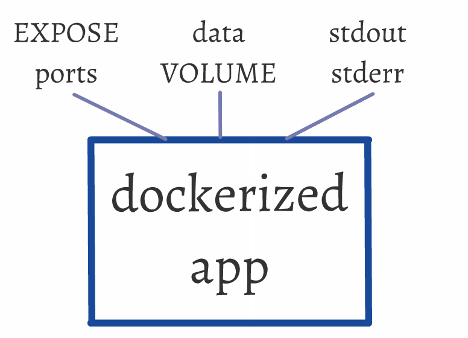

name: inverse
layout: true
class: center, middle, inverse

---

.percent100[.center[]]

# Dockerized app 必要條件

???

Img src: http://getacover.com/covers/9/8619_1532.jpg

---

layout: false

# Lab setup

.pull-left[
## VMs

1. `main`:
   - `up`
   - `ssh`

2. `registry`:
   - `up`
]

.pull-right[
## Lab directory
- `build-nginx`
- `build-fork`
]


---

class: center, middle

.percent100[.center[]]

---

template: inverse

Principle #1
# EXPOSE ports

### port mapping
### container linking

---

class: center, middle

## ☛ VII. Port binding :
Export services via port binding


.footnote[.red[*] See "[12 Factor App](http://12factor.net/)"
]

---

See previous server examples:

 - build-redis
 - build-redis-el5
 - build-redis-linking
 - build-chat

---

template: inverse

Principle #2
# data VOLUME

---

class: center, middle

## ☛ IV. Backing Services:
Treat backing services as attached resources

.footnote[.red[*] See "[12 Factor App](http://12factor.net/)"
]


---

# Example: Nginx

Official document says: .red[*]

> ## ☛ How to use this image
> hosting some simple static content
>
> `docker run --name some-nginx  \` <br/>
> &nbsp;&nbsp;&nbsp;&nbsp;&nbsp;&nbsp;&nbsp;&nbsp;`   -v /some/content:/usr/share/nginx/html:ro  \` <br/>
> &nbsp;&nbsp;&nbsp;&nbsp;&nbsp;&nbsp;&nbsp;&nbsp;`   -d nginx`
> ## ☚

.footnote[.red[*] Official [`nginx`](https://registry.hub.docker.com/_/nginx/) at Docker Hub.]

---

# Try it!

1. Prepare an HTML file `index.html` at current directory.

--
2. Run an Nginx container:

   ```bash
   $ docker run -d --name nginx   \
        -p 10081:80               \
        -v $(pwd):/usr/share/nginx/html:ro  \
        nginx:1.7.9
   ```

--
3. Try to access it!

   ```bash
   $ curl  localhost:10081
   ```

--
4. Or, use your favorite browser from the host machine!

---

# ... or, try it with Docker Compose

1. the same
2. Run an Nginx container with Docker Compose:

   ```yaml
   nginx:
       image: nginx:1.7.9
       ports:
           - 10081:80
       volumes:
           - .:/usr/share/nginx/html:ro
   ```

---

template: inverse

Principle #3
# daemon off

---

class: center, middle

TL;DR
# **Avoid "daemonize" yourself**
--

## Stay foreground in your app.
## Let Docker do necessary daemonize stuff for you.

---

class: center, middle

# What is "daemonize"?

---

# Typical daemon program will:

- Close all open file descriptors (especially standard input, standard output and standard error)
- Change its working directory to the root filesystem, to ensure that it doesn’t tie up another filesystem and prevent it from being unmounted
- Reset its umask value
- Run in the background (i.e., fork)
- Disassociate from its process group (usually a shell), to insulate itself from signals (such as HUP) sent to the process group
- Ignore all terminal I/O signals
- Disassociate from the control terminal (and take steps not to reacquire one)
- Handle any SIGCLD signals

.footnote[.red[*] Source: [daemonize — A tool to run a command as a daemon](http://software.clapper.org/daemonize/)
]

---

# Typical daemon program will:

- .red[Close all open file descriptors] (especially standard input, standard output and standard error)
- Change its working directory to the root filesystem, to ensure that it doesn’t tie up another filesystem and prevent it from being unmounted
- Reset its umask value
- .red[Run in the background] (i.e., .red[fork])
- .red[Disassociate from its process group] (usually a shell), to insulate itself from signals (such as HUP) sent to the process group
- Ignore all terminal I/O signals
- .red[Disassociate from the control terminal] (and take steps not to reacquire one)
- Handle any SIGCLD signals

.footnote[... .red[Conflicts] with Docker's process model; cannot be **_dockerized_**.
]


---

class: center, middle

Current trend:

# **Avoid "daemonize" yourself**

## rely on other tools to do it for you!

---

# Avoid "daemonize" yourself

> Twelve-factor app processes .red[should never daemonize or write PID files]. Instead, rely on the operating system’s process manager (such as Upstart...) to manage output streams, respond to crashed processes, and handle user-initiated restarts and shutdowns.

.footnote[.red[*] [Quote] 12 Factor App: [VIII. Concurrency](http://12factor.net/concurrency)]

---

# Avoid "daemonize" yourself

> Programs meant to be run under supervisor .red[should not daemonize themselves]. Instead, they .red[should run in the foreground]. They .red[should not detach from the terminal] from which they are started.

.footnote[.red[*] [Quote] Supervisord: [Nondaemonizing of Subprocesses](http://supervisord.org/subprocess.html)]

---

class: center, middle

# **Avoid "daemonize" yourself**

## Stay foreground in your app.
## Let Docker do necessary daemonize stuff for you.

---

class: center, middle

# What if ... "daemonize yourself" <br/> in Docker?

---

# Lab directory

`build-fork`

---

- child exit first, parent exit last
  ```bash
  $ ./fork  5  0
  ```
  ```
  [Parent] PID = 75554
  [Parent] forked a child with PID = 75555
  [Parent] sleeping...
        [Child] PID = 75555
        [Child] exit...
  [Parent] awaken!
  [Parent] exit...
  ```

--
- parent exit first, child exit last (orphan)
  ```bash
  $ ./fork  0  5
  ```
  ```
  [Parent] PID = 75569
  [Parent] forked a child with PID = 75570
  [Parent] exit...
        [Child] PID = 75570
        [Child] sleeping...
        [Child] awaken!    ◀◀ orphan!
        [Child] exit...    ◀◀ orphan!
  ```

---

# Docker: normal case

- child exit first, parent exit last
  ```bash
  $ docker-compose  run  normal
  ```
  ```
  [Parent] PID = 1
  [Parent] forked a child with PID = 8
  [Parent] sleeping...
        [Child] PID = 8
        [Child] exit...
  [Parent] awaken!
  [Parent] exit...
  ```


--

- Use `docker logs` to see...


---

# Docker: abnormal case

- parent exit first, child exit last (orphan)
  ```bash
  $ docker-compose  run  abnormal
  ```
  ```
  [Parent] PID = 1
  [Parent] forked a child with PID = 5
  [Parent] exit...
                  ◀◀ no orphan running; killed immediately by Docker!
  ```

--

- Use `docker logs` to see...


---

class: center, middle

# Lessons Learnt

## Keep PID=1 process alive in Docker container!

---

class: center, middle

# Working with legacy servers...

--

### ☛ built-in optional "daemon off" mode
### ☛ write additional wrapper, if necessary

---

# Lab directory

`build-nginx`

---

# To daemonize or not to daemonize...

- "Daemon off" mode (correct!)

  ```yaml
  FROM  nginx:1.7.9
  CMD [ "nginx", "-g", "daemon off;" ]
  ```

--
- "Daemonize" mode (wrong!)

  ```yaml
  FROM  nginx:1.7.9
  CMD [ "nginx" ]
  ```

---

# For more info

Analysis:

  - [Docker and the PID 1 zombie reaping problem](https://blog.phusion.nl/2015/01/20/docker-and-the-pid-1-zombie-reaping-problem/)

Possible solutions:

  - [`ENTRYPOINT`](http://docs.docker.com/reference/builder/#entrypoint)

  - [How to propagate SIGTERM to a child process in a Bash script](http://veithen.github.io/2014/11/16/sigterm-propagation.html)

  - [baseimage-docker](https://github.com/phusion/baseimage-docker)

  - [Multiple processes inside Docker](http://blog.chazomatic.us/2014/06/18/multiple-processes-inside-docker/) (minit)

  - [Docker: 使用 s6 作為多服務容器的啟動管理程序](http://kfei.logdown.com/posts/245469-using-s6-as-the-init-process-for-muliple-service-docker-container)


---

class: center, middle

## ☛ XI. Logs
Treat logs as event streams

.footnote[.red[*] See "[12 Factor App](http://12factor.net/)"
]

---

# FYI, "dockerize" tool

"An utility to simplify running applications in docker containers."

- Source at GitHub: [jwilder/dockerize](https://github.com/jwilder/dockerize)

- Article: "[A Simple Way to Dockerize Applications](http://jasonwilder.com/blog/2014/10/13/a-simple-way-to-dockerize-applications/)"


---

class: center, middle

# Questions?
