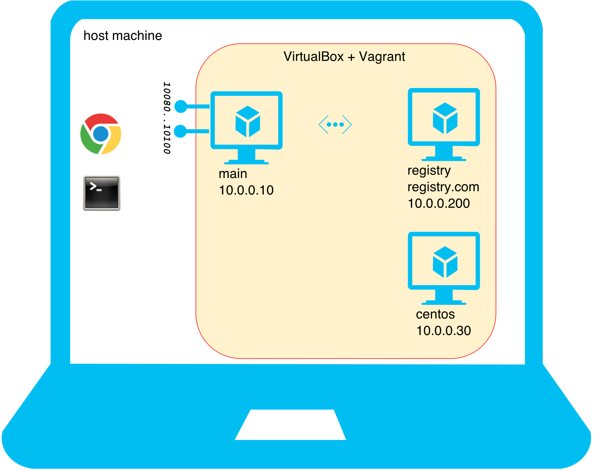

name: inverse
layout: true
class: center, middle, inverse

---

.center[]

# Lab #1: 暖身／熟悉實習環境

???

Img src: http://andrewgarrison.com/wp-content/uploads/2012/10/CodeMonkey-68762_960x360.jpg

---

layout: false
class: center, middle

`% cd docker-workshop`

---

template: inverse

# Topology

---

layout: false
class: center, middle

VM - An almost isolated environment inside the Host Machine

.percent90[
]

---

class: center, middle

A Plain VM (without any Docker stuff) for comparison

.percent90[
]
---

class: center, middle

We'll use this most of the time...

.percent90[
]
---

class: center, middle

Some TCP ports are exposed for host machine to access...

.percent90[
]
---

class: center, middle

Our private registry...

.percent90[
]
---

class: center, middle

That's all!

.percent90[
]

---

template: inverse

# Vagrantfile

### VM definition file for Vagrant

---

# IP addresses

Take a look at `Vagrantfile` (simplified):

```yaml
Vagrant.configure(2) do |config|

  config.vm.define "main", primary: true do |node|
    node.vm.network "private_network", ip: "10.0.0.10"
  end

  config.vm.define "centos" do |node|
    node.vm.network "private_network", ip: "10.0.0.30"
  end

  config.vm.define "registry" do |node|
    node.vm.network "private_network", ip: "10.0.0.200"
  end

end
```

---

# OS to be emulated

```yaml
Vagrant.configure(2) do |config|

  config.vm.define "main", primary: true do |node|
    node.vm.box = "williamyeh/ubuntu-trusty64-docker"
  end

  config.vm.define "centos" do |node|
    node.vm.box = "bento/centos-5.11"
  end

  config.vm.define "registry" do |node|
    node.vm.box = "williamyeh/docker-workshop-registry"
  end

end
```

Vagrant boxes used here:

  - [`williamyeh/ubuntu-trusty64-docker`](https://vagrantcloud.com/williamyeh/boxes/ubuntu-trusty64-docker)
  - [`williamyeh/docker-workshop-registry`](https://vagrantcloud.com/williamyeh/boxes/docker-workshop-registry)
  - [`bento/centos-5.11`](https://vagrantcloud.com/bento/boxes/centos-5.11)


---

class: center, middle

# Open **VirtualBox** side by side<br/>to see effect...


---

# VM status

Show current status of all VMs:

```bash
% vagrant status
```

---

# Power on

Power on all VMs:

```bash
% vagrant up
```

--

<br/>

Show current status of all VMs, again:

```bash
% vagrant status
```

---

# Login

SSH into the *default* VM:

```bash
% vagrant ssh
```

--
<br/>

SSH into the specific VM:

&nbsp;&nbsp;&nbsp;&nbsp;  `% vagrant ssh  `  &nbsp;&nbsp;  main

&nbsp;&nbsp;&nbsp;&nbsp;  `% vagrant ssh  `  &nbsp;&nbsp;  centos

&nbsp;&nbsp;&nbsp;&nbsp;  `% vagrant ssh  `  &nbsp;&nbsp;  registry

&nbsp;&nbsp;&nbsp;&nbsp;  `% vagrant ssh  `  &nbsp;&nbsp;  _name_of_VM_

---

#  Looking around inside the VM...

- Machine arch, kernel version, etc.

   ```bash
   $ uname -a
   ```

- OS name, version, etc.

   ```bash
   $ cat /etc/os-release
   ```

- Linux name and version of RedHat families (RHEL, CentOS, etc.):

   ```bash
   $ cat /etc/redhat-release
   ```

---

# Directory mapping


.pull-left[
## Host machine

```bash
# Mac or Linux
% pwd
# Windows
% cd


% ls -al
```
]

--

.pull-right[
## Guest machine

```bash
$ pwd

$ ls -al $HOME/docker-workshop
```
]

--

<br/><br/>
Mapping rule:

```yaml
Vagrant.configure(2) do |config|

  #                         host  guest
  config.vm.synced_folder   "." , "/home/vagrant/docker-workshop"

end
```

---

# Logout

.pull-right[
## Guest machine

```bash
$ exit
```
]

--
<br clear="all">

.pull-left[


## Host machine
Current status of all VMs:

```bash
% vagrant status
```

Can login again:

```bash
% vagrant ssh
```
]

---

# Shutdown

Shutdown all VM instances:

```bash
% vagrant halt

% # current VM status?
% vagrant status
```

--
<br/>

We can power on all VM instances, later:

```bash
% vagrant up

% # current VM status?
% vagrant status
```

---

# Destroy

.red[**DANGEROUS!!!**]

Destroy all VM instances:

```bash
% vagrant destroy

% # current VM status?
% vagrant status
```

--

<br/>

Since all VM instances have been destroyed altogether, the following power on procedure will take times, as if it has never been `vagrant up` before...

```bash
% vagrant up

% # current VM status?
% vagrant status
```

---

class: center, middle

# One more thing about <br/> multi-VM environment...

---

# Which VM to work with?

Show current status of all VMs:

```bash
% vagrant status
```

--

<br/>

Power on the `main` VM:

```bash
% vagrant up  main
```

--

SSH into the `main` VM:

```bash
% vagrant ssh  main
```

.footnote[Ditto for built-in (`halt`, `destroy`, `provision`, etc) and plugin (e.g., `snapshot`) commands.
]

---

# Want to learn more?

Read my [Vagrant Tutorial series](http://www.codedata.com.tw/social-coding/vagrant-tutorial-1-developer-and-vm) at CodeData.

.center[.percent90[
]]

---

class: center, middle

# Questions?
