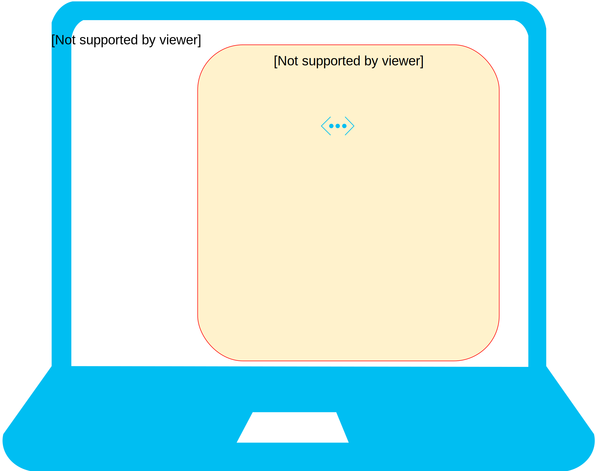
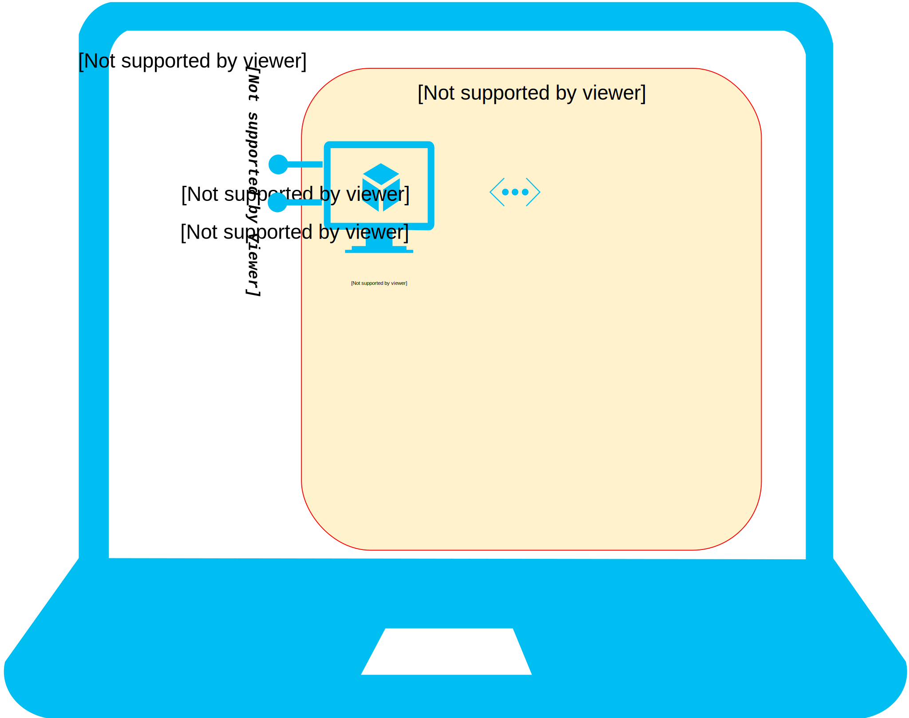
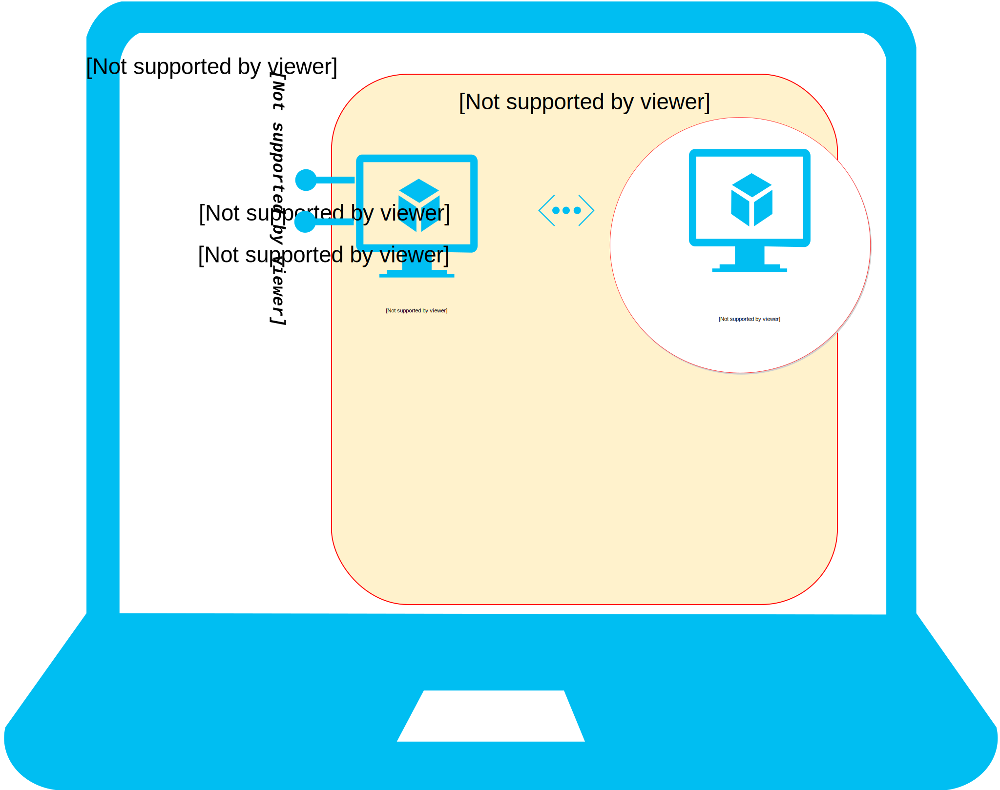

name: inverse
layout: true
class: center, middle, inverse

---

.center[]

# Lab #1: 暖身／熟悉實習環境

???

Img src: http://andrewgarrison.com/wp-content/uploads/2012/10/CodeMonkey-68762_960x360.jpg

---

layout: false
class: center, middle

`$ cd docker-workshop`

---

template: inverse

# Topology

---

layout: false
class: center, middle

An almost isolated environment inside the Host Machine

.percent90[
]

---

class: center, middle

A Plain VM (without any Docker)

.percent90[
]
---

class: center, middle

We'll use this most of the time...

.percent90[
]
---

class: center, middle

Some TCP ports are exposed for host machine to access...

.percent90[
]
---

class: center, middle

More Docker hosts to use, if necessary...

.percent90[
]
---

class: center, middle

Our private registry...

.percent90[
]
---

class: center, middle

That's all!

.percent90[
]

---

template: inverse

# Vagrantfile

---

# IP addresses

Take a look at `Vagrantfile` (simplified):

```yaml
Vagrant.configure(2) do |config|

  config.vm.define "main", primary: true do |node|
    node.vm.network "private_network", ip: "10.0.0.10"
  end

  config.vm.define "centos" do |node|
    node.vm.network "private_network", ip: "10.0.0.30"
  end

  config.vm.define "registry" do |node|
    node.vm.network "private_network", ip: "10.0.0.200"
  end

end
```

---

# Operating systems

```yaml
Vagrant.configure(2) do |config|

  config.vm.define "main", primary: true do |node|
    node.vm.box = "williamyeh/ubuntu-trusty64-docker"
  end

  config.vm.define "centos" do |node|
    node.vm.box = "chef/centos-5.11"
  end

  config.vm.define "registry" do |node|
    node.vm.box = "williamyeh/insecure-registry"
  end

end
```

Vagrant boxes used here:

  - [`williamyeh/ubuntu-trusty64-docker`](https://vagrantcloud.com/williamyeh/boxes/ubuntu-trusty64-docker)
  - [`williamyeh/insecure-registry`](https://vagrantcloud.com/williamyeh/boxes/insecure-registry)
  - [`chef/centos-5.11`](https://vagrantcloud.com/chef/boxes/centos-5.11)


---

class: center, middle

# Open **VirtualBox** side by side<br/>to see effect...

---

# Which VM to work with?

Show current status of all VMs:

```bash
$ vagrant status
```

--

Power on the `main` VM:

```bash
$ vagrant up main
```

--

SSH into the VM:

```bash
$ vagrant ssh main
```

.footnote[Ditto for built-in (`halt`, `destroy`, `provision`, etc) and plugin (e.g., `snapshot`) commands.
]

---

#  Looking around

Inside the VM:

- Machine arch, kernel version, etc.

   ```bash
   $ uname -a
   ```

- OS name, version, etc.

   ```bash
   $ cat /etc/os-release
   ```

- Linux name and version of RedHat families (RHEL, CentOS, etc.):

   ```bash
   $ cat /etc/redhat-release
   ```

---

# Quiz

Ditto for other VM:

  - `centos`

---

class: center, middle

# Questions?
