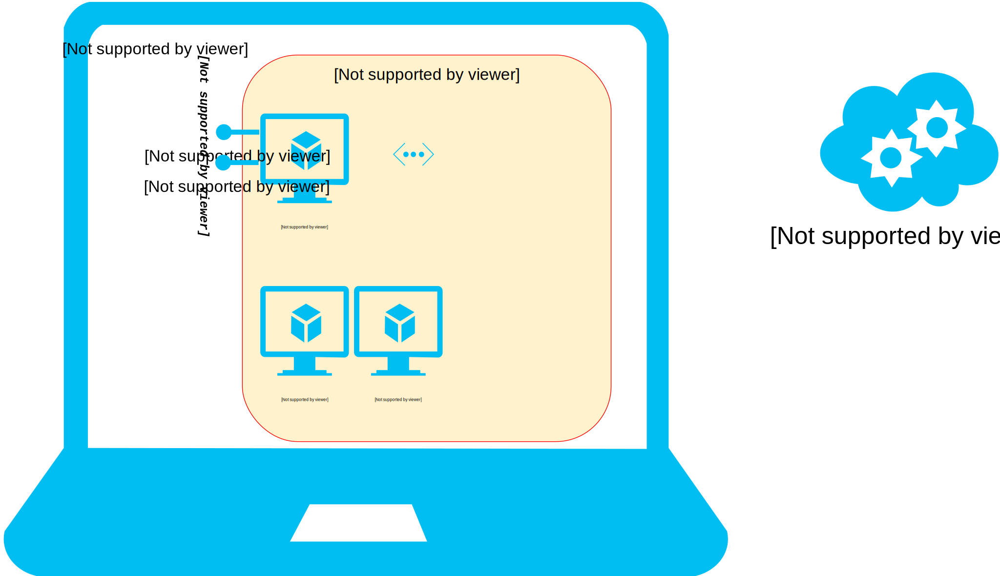
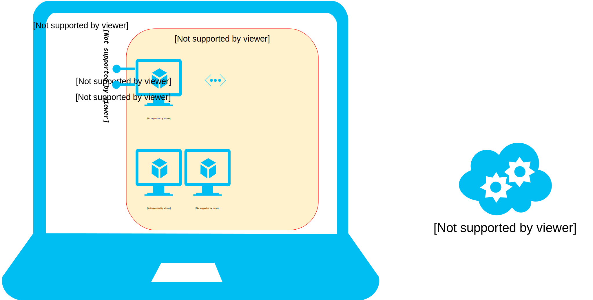

name: inverse
layout: true
class: center, middle, inverse

---

.center[]

# 名詞初探／<br/>Images 與 Containers

???

Img src: http://blog.coyoteproductions.co.uk/cartoons/software-simian-code-monkey/attachment/real-code-monkey/

---

layout: false
class: center, middle

`$ cd docker-workshop`

---

template: inverse

# Basic Terminology
## Image & Container

---

layout: false

# Analogy

☛ Object-Oriented Programming

>| Static Structure | ↔ | Dynamic Behavior |
|:----------------:|---|:----------------:|
|  class           | ↔ |  object          |

--

☛ Operating Systems

>| Static Structure | ↔ | Dynamic Behavior |
|:----------------:|---|:----------------:|
|  EXE             | ↔ |  process         |

--

☛ Docker

>| Static Structure | ↔ | Dynamic Behavior |
|:----------------:|---|:----------------:|
|  image 映像檔     | ↔ |  container 容器   |

---

# List...

>| Static Structure | ↔ | Dynamic Behavior |
|:----------------:|---|:----------------:|
|  image 映像檔     | ↔ |  container 容器   |

.footnote[.red[☛] Open 〈[一張圖總結 Docker 的命令](http://philipzheng.gitbooks.io/docker_practice/content/_images/cmd_logic.png)〉 side by side for your easy reference.]

--

.pull-left[
- images:

   ```bash
   docker images
   ```
]

--

.pull-right[
- containers:

   ```bash
   docker ps
   ```

- all containers (including stopped):

   ```bash
   docker ps -a
   ```
]

---

template: inverse

# Pull Images

---

class: center, middle

# Docker Hub
official Docker registry service

.percent100[
]

---

template: inverse

#Naming

.center[]

.right[Source: http://martinfowler.com/bliki/TwoHardThings.html]

---

class: center, middle

## 以下動作，請先確定.red[網路順暢]。
## 否則，請遵從講師指示，再行動。

---

# Pull images from [Docker Hub](https://registry.hub.docker.com/)

--

## Official images

a.k.a. "official repositories" (*official repo*)

.pull-left[

```bash
docker pull busybox
```

```bash
docker pull redis
```

```bash
docker pull ubuntu
```
]

--

.pull-right[

... with tags .red[*]:

- `ubuntu:latest`
- `ubuntu:14.04`
- `ubuntu:trusty`

]

.footnote[.red[*] See [`ubuntu` repo at Docker Hub](https://registry.hub.docker.com/_/ubuntu/) for more info.
]


---

# Some things about Docker Image

## ID (as hash)

Analogy: alias, symbolic link

```bash
$ docker images
```
--

## File system layering

Analogy: single inheritance

```bash
$ docker images --tree
```

.footnote[.red[*] See official doc about [Layers](https://docs.docker.com/terms/layer/). ]

---

# ... from [Docker Hub](https://registry.hub.docker.com/)

## User-Created images

Registered users can create their own repos hosted on Docker Hub!

.pull-left[

```bash
docker pull dockerfile/ghost
```

```bash
docker pull williamyeh/wrk
```

```bash
docker pull williamyeh/scala
```
]

--

.pull-right[

... with tags .red[*]:

- `williamyeh/scala:latest`
- `williamyeh/scala:2.11.5`
- `williamyeh/scala:2.10.4`

]

.footnote[.red[*] See [`williamyeh/scala` repo at Docker Hub](https://registry.hub.docker.com/u/williamyeh/scala/) for more info.
]

---

class: center, middle

# Other Docker registry providers
-
.percent100[
]
---

# ... from *another* registry

.pull-left[

### Google Container Registry
(see [doc](https://cloud.google.com/tools/container-registry/))

- `gcr.io/ACCOUNT/IMAGE`


### Quay.io
(see [doc](http://docs.quay.io/guides/pushpull.html))

- `quay.io/ACCOUNT/IMAGE`

]

--

.pull-right[

### Self-hosted private registry
(see [doc](https://github.com/docker/docker-registry))

- `IP:PORT/ACCOUNT/IMAGE`

]

---

# Quiz

Which case?


- `busybox`

--

- `ubuntu:14.04`

--

- `dockerfile/ghost`

--

- `registry.com/dockerfile/ghost`

--

- `10.0.0.200/dockerfile/ghost`

---

template: inverse

# Private registry for this workshop

.footnote[.red[*] See this workshop's [Vagrantfile](https://github.com/William-Yeh/docker-workshop/blob/master/Vagrantfile) for details.
]

---

class: center, middle

Our private registry...

.percent90[
]
---

# Private Registry

`Vagrantfile` (simplified):

```yaml
Vagrant.configure(2) do |config|

  config.vm.define "registry" do |node|
    node.vm.box = "williamyeh/insecure-registry"
    node.vm.network "private_network", ip: "10.0.0.200"
  end

end
```

---

# Private registry for this workshop


- Pull images:

  ```bash
  docker pull 10.0.0.200/ACCOUNT/IMAGE
  ```

  or,

  ```bash
  docker pull registry.com/ACCOUNT/IMAGE
  ```

--
... or, use the capital <large>`DOCKER`</large> form: .red[*]

```bash
DOCKER  pull  ACCOUNT/IMAGE
```

.footnote[.red[*] Source: https://github.com/William-Yeh/docker-host-tools/
]

---

# Pre-loaded images

See `provision/IMAGE-LIST`.

---

# Example: `ipython/notebook`


```bash
$ DOCKER pull ipython/notebook

$ docker run -d    \
    -p 10080:8888  \
    -e "PASSWORD=123" -e "USE_HTTP=1"  \
    ipython/notebook
```

Browser:

- View: http://localhost:10080/

References:

- [ipython/notebook](https://registry.hub.docker.com/u/ipython/notebook/) at Docker Hub

- [IPython Notebook](http://ipython.org/notebook.html)

---

# Example: `dockerfile/ghost`

```bash
$ DOCKER pull dockerfile/ghost

$ docker run -d    \
    -p 10080:2368  \
    dockerfile/ghost
```

Browser:

- View blog: http://localhost:10080/
- Sign up: http://localhost:10080/ghost/signup/

References:

- [dockerfile/ghost](https://registry.hub.docker.com/u/dockerfile/ghost/) at Docker Hub

- [Deploying Ghost With Docker](http://www.allaboutghost.com/deploying-ghost-with-docker/)

---

class: center, middle

# Questions?
