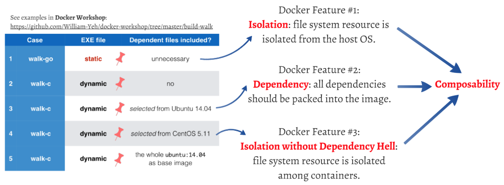
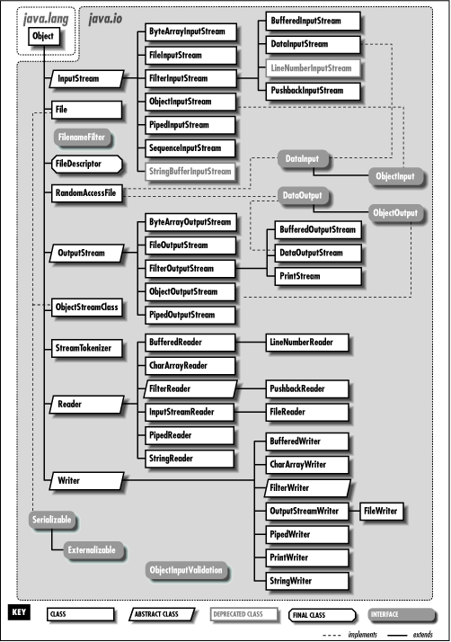
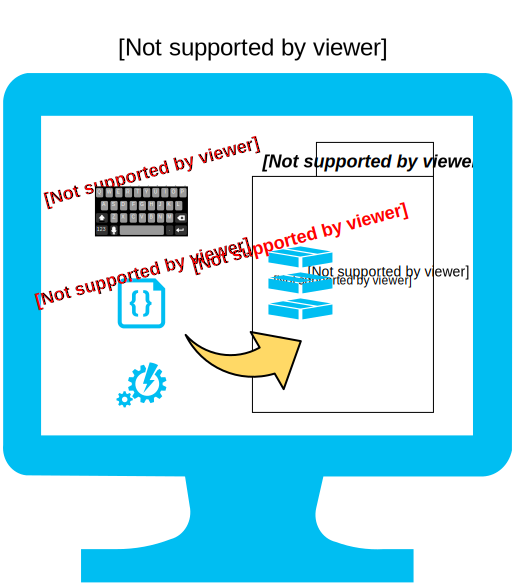
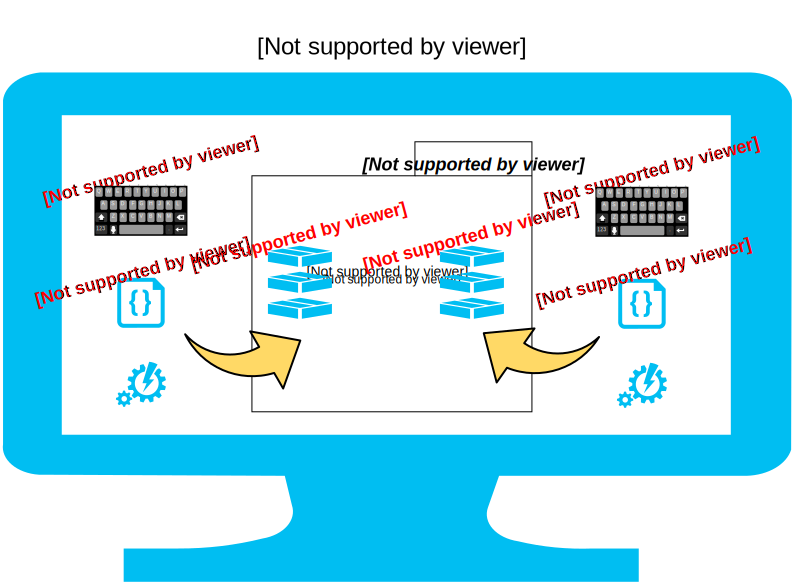

name: inverse
layout: true
class: center, middle, inverse

---

.percent90[.center[]]

# 從零開始／極簡化 Docker Image

???

Img src: http://www.vectorstock.com/royalty-free-vector/cook-vector-684665

---

layout: false

# Lab setup

--

.pull-left[
## VMs

1. `main`:
   - `up`
   - `ssh`

]

--

.pull-right[
## Lab directory
- `build-walk`
]


---


class: center, middle

.percent110[.center[]]


---

template: inverse

# Tasks - directory traversal

Similar to standard Linux `tree` command

---

# Two versions compiled from the same C source

```bash
$ cd ~/docker-workshop/build-walk
```

--

1. Static version (compiled with `gcc --static`)

   ```bash
   $ file  walk-static
   walk-static: ELF 64-bit LSB  executable, x86-64,
   version 1 (SYSV), statically linked, not stripped

   $ ./walk-static
   ```

--
2. Dynamic version (compiled with `gcc`)

   ```bash
   $ file  walk-dynamic
   walk-dynamic: ELF 64-bit LSB  executable, x86-64, version 1 (SYSV),
   dynamically linked (uses shared libs), for GNU/Linux 2.6.24,
   BuildID[sha1]=bba8e784a630f4260a31a39fa0826b4a00147fea,
   not stripped

   $ ./walk-dynamic
   ```

---

template: inverse

# Layers

## Which base image to build from?

---

# Analogy: base class (super class)

.percent50[.center[]]

???

Img src: http://doc.sumy.ua/prog/java/exp/ch10_01.htm

---

# Docker base images

--

- Minimalism: based on `scratch` or `busybox`

  - See: [Quest for minimal Docker images 【追求極簡化 Docker image 之路】](http://bit.ly/docker-mini)

--

- Modest: barebone Linux distributions
  - Reuse your existing Linux experiences: make, ant, apt-get, yum...

--

- Convenience: programming languages installed
  - Reuse your existing experiences: gem, maven, npm, pip...

---

# Let's start by this approach...

- .red[☛ ☛ ☛ **Minimalism: based on `scratch` or `busybox`** ☚ ☚ ☚]

  - See: [Quest for minimal Docker images 【追求極簡化 Docker image 之路】](http://bit.ly/docker-mini)

- Modest: barebone Linux distributions
  - Reuse your existing Linux experiences: make, ant, apt-get, yum...

- Convenience: programming languages installed
  - Reuse your existing experiences: gem, maven, npm, pip...

---

template: inverse

# Case 1
## "scratch" + Fully statically-linked ELF file


---

class: center, middle

# Case 1
## `scratch` + Fully statically-linked ELF file

<br/>

```$ cd ~/docker-workshop/build-walk/case1```

---

class: center, middle

# Learning by Analogy...

---

# Analogy: OOP inheritance

.percent90[.center[]]

Add something to **base class** (**super class**).

---

# How about Docker?

.percent90[.center[]]

Add something to ...?

--

.center[... Add something to **base image**!]

---

# Analogy: OOP root class `Object`

Java: `java.Object`

```java
public class Foo extends Object {
    //...
}
```

C#: `System.Object`

```csharp
public class Foo : Object {
    //...
}
```

--
<br/>

In most modern OOPLs, `Object` is *implicitly* inherited.


---

# How about Docker?

<br/>
In Docker, you have to specify the base image *explicitly*

--

&nbsp;&nbsp;&nbsp; ... at the first line in `Dockerfile`

--

&nbsp;&nbsp;&nbsp;&nbsp;&nbsp;&nbsp; ... unless the base image is `scratch`. .red[*]


.footnote[.red[*] Since Docker 1.5.0; see [official document](https://registry.hub.docker.com/_/scratch/) for more info.]

---

# Let's build a Docker image from a zero-sized base!

.percent90[.center[]]

Add something to the `scratch` **base image**.

---

# We're going to do...

Add the `walk-static` file onto the `scratch` (空, 無) base image.

### Target image layout

```
             +-------------------------------------+
             |                                     |
             |                                     |
             |  exe file:  walk-static    (< 3 MB) |
             |                                     |
             |                                     |
             +-------------------------------------+
             |                                     |
             |                                     |
             |  base image:  scratch      (0 byte) |
             |                                     |
             |                                     |
             +-------------------------------------+
```

---

class: center, middle

# Dockerfile

## "Makefile" for Docker images

---

# Dockerfile for "walk-static"

```dockerfile
# dockerize "walk-static"

FROM  scratch

COPY  walk-static  /bin/walk
```

.footnote[.red[☛] Open 〈[Dockerfile 指令](http://philipzheng.gitbooks.io/docker_practice/content/dockerfile/instructions.html)〉 and "[Dockerfile Reference](https://docs.docker.com/reference/builder/)" side by side for your easy reference.]

---

# 逐行拆解 Dockerfile 指令

## #1: Base image

```dockerfile
FROM  scratch
```

.footnote[.red[*] This line can be omitted since Docker 1.5.0; see [official document](https://registry.hub.docker.com/_/scratch/) for more info.]

--
<br/>
<br/>
Remember image hierarchy?

```bash
$ dockviz images --tree
```

---

# 逐行拆解 Dockerfile 指令

## #2: Add something new to the base image

```dockerfile
COPY  walk-static  /bin/walk
```

<br/><br/>

### Effect:
1. copy to `/bin/` directory within the target image,
2. and rename it to `walk`.

---

# Build it!

```bash
$ docker build .
```

.percent50[.right[]]


.footnote[.red[*] See the _very very very ugly_ ID?]


---

# Look at what we've built...


```bash
$ docker images
```

.footnote[.red[*] See the _very very very ugly_ ID?]

--

Or,

```bash
$ dockviz images --tree
```

---

# 收割時刻：Run it!

Foreground mode:

```bash
$ docker run  `THE_UGLY_IMAGE_ID`  \
    /bin/walk
```

--

☛ [Compare] without Docker, it is used in this way:

```bash
$ ./walk-static
```


--

<br/><br/>
Container status:

```bash
# current status
$ docker ps

# historical status
$ docker ps -a
```

---

# Image IDs and Container IDs


<br/>

>| Static Structure | ↔ | Dynamic Behavior |
|:----------------:|---|:----------------:|
|  image 映像檔     | ↔ |  container 容器   |


.pull-left[
- images:

   ```bash
   $ docker images
   ```
]

.pull-right[
- containers:

   ```bash
   $ docker ps
   ```
]


---

# Different output... Why?

.pull-left[
- Without Docker

```bash
$ ./walk-static
```
```

2015-04-25     4096  /
2015-04-17     4096  /bin
2014-10-07  1021112  /bin/bash
2013-10-21    31152  /bin/bunzip2
2013-11-14  1918032  /bin/busybox
2013-10-21    31152  /bin/bzcat
2013-10-21        6  /bin/bzcmp
2013-10-21     2140  /bin/bzdiff
2013-10-21        6  /bin/bzegrep
2013-10-21     4877  /bin/bzexe
2013-10-21        6  /bin/bzfgrep
2013-10-21     3642  /bin/bzgrep
2013-10-21    31152  /bin/bzip2
2013-10-21    14480  /bin/bzip2recover
2013-10-21        6  /bin/bzless
...[略]
```
]


--

.pull-right[
- With Docker

```bash
$ docker run  `IMAGE_ID`  \
    /bin/walk
```
```
2015-04-25     4096  /
2015-04-25        0  /.dockerenv
2015-04-25        0  /.dockerinit
2015-04-25     4096  /bin
2015-04-25   895098  /bin/walk
2015-04-25     4096  /etc
2015-04-25       13  /etc/hostname
2015-04-25      174  /etc/hosts
2015-04-25       12  /etc/mtab
2015-04-25      171  /etc/resolv.conf
```
]

---

# Isolation: file system resource

```
|                                                                       |
|      +-------------------------------------+                          |
|      |                                     |                          |
|      | resources injected by Docker engine |                          |
|      | (/etc/hosts, /etc/resolv.conf, etc) |                          |
|      |                                     |                          |
|      +-------------------------------------+                          |
|      |                                     |                          |
|      |                                     |                          |
|      |  exe file:  walk-static   ( < 3 MB) |                          |
|      |                                     |                          |
|      |                                     |                          |
|      +-------------------------------------+                          |
|      |                                     |                          |
|      |                                     |                          |
|      |  base image:  scratch      (0 byte) |                          |
|      |                                     |                          |
|      |                                     |                          |
|      +-------------------------------------+                          |
|                 Docker container                                      |
|                                                  host machine         |
|                                                  root file system     |
|                                                                       |
+-----------------------------------------------------------------------+
```


---

# Isolation: file system resource

.pull-left[
- Without Docker

```bash
$ ./walk-static
```

☛ Sees the whole file system of the enclosing OS
```


2015-04-25     4096  /
2015-04-17     4096  /bin
2014-10-07  1021112  /bin/bash
2013-10-21    31152  /bin/bunzip2
2013-11-14  1918032  /bin/busybox
2013-10-21    31152  /bin/bzcat
2013-10-21        6  /bin/bzcmp
2013-10-21     2140  /bin/bzdiff
2013-10-21        6  /bin/bzegrep
2013-10-21     4877  /bin/bzexe
2013-10-21        6  /bin/bzfgrep
2013-10-21     3642  /bin/bzgrep
2013-10-21    31152  /bin/bzip2
...[略]
```
]


--

.pull-right[
- With Docker

```bash
$ docker run  `IMAGE_ID`  \
    /bin/walk
```

☛ Only sees the file system **within** the target image

```

2015-04-25     4096  /
2015-04-25        0  /.dockerenv
2015-04-25        0  /.dockerinit
2015-04-25     4096  /bin
2015-04-25   895098  /bin/walk
2015-04-25     4096  /etc
2015-04-25       13  /etc/hostname
2015-04-25      174  /etc/hosts
2015-04-25       12  /etc/mtab
2015-04-25      171  /etc/resolv.conf
```
]


---

class: center, middle

# Docker Feature #1:
# .red[Isolation]: file system resource is isolated from the host OS.

---

# Container technology

歷史淵源：“chroot”

> Unix 的 chroot 功能，可針對執行中的行程及子行程，改變它所認知到的根目錄 ([root directory](http://en.wikipedia.org/wiki/Root_directory))。

> 在此環境下的程式，無法存取此目錄之外的檔案。因此，這環境也被稱為「chroot 監獄」("chroot jail")。

.footnote[.red[*] 改譯自 [chroot](http://zh.wikipedia.org/wiki/Chroot) at Wikipedia.]

--

“chroot on steroids”

> 2005 年，昇陽電腦在 Solaris 系統上開發出 Solaris Containers，稱它是「吃了類固醇的 chroot」（“chroot on steroids”）。


---

template: inverse

# Case 2
## "scratch" + Forget to link an ELF file <br/> with its dependent .so files


---

class: center, middle

# Case 2
## `scratch` + Forget to link an ELF file <br/> with its dependent .so files

<br/>

```$ cd ~/docker-workshop/build-walk/case2```

---

# Dynamic ELF

This time, use dynamic version `walk-dynamic` instead:

--

```bash
$ cd ~/docker-workshop/build-walk/case2

$ ls -al

$ file  walk-dynamic
walk-c: ELF 64-bit LSB  executable, x86-64, version 1 (SYSV),
*dynamically linked (uses shared libs), for GNU/Linux 2.6.24,
BuildID[sha1]=bba8e784a630f4260a31a39fa0826b4a00147fea,
not stripped


$ ./walk-dynamic
```

---

# We're going to do...

Add the `walk-dynamic` file to the `scratch` (空, 無) base image.

### Target image layout

```
             +-------------------------------------+
             |                                     |
             |                                     |
             |  exe file:  walk-dynamic   (< 1 MB) |
             |                                     |
             |                                     |
             +-------------------------------------+
             |                                     |
             |                                     |
             |  base image:  scratch      (0 byte) |
             |                                     |
             |                                     |
             +-------------------------------------+
```


---

class: center, middle

# Dockerfile

## "Makefile" for Docker images

---

# Dockerfile for "walk-dynamic"

```dockerfile
# dockerize "walk-dynamic"

FROM  scratch

COPY  walk-dynamic  /bin/walk
```

---

# 逐行拆解 Dockerfile 指令

## #1: Base image

```dockerfile
FROM  scratch
```

.footnote[.red[*] This line can be omitted since Docker 1.5.0; see [official document](https://registry.hub.docker.com/_/scratch/) for more info.]

---

# 逐行拆解 Dockerfile 指令

## #2: Add something new to the base image

```dockerfile
COPY  walk-dynamic  /bin/walk
```


.footnote[.red[*] Effect: copy to `/bin/walk` in the target image.]

---

# Build it!

```bash
$ docker build .
```

.percent50[.right[]]


.footnote[.red[*] See the _very very very ugly_ ID?]


---

# Look at what we've built...


```bash
$ docker images
```

.footnote[.red[*] See the _very very very ugly_ ID?]

--

Or,

```bash
$ dockviz images --tree
```

---

# Run it!

```bash
$ docker run  `THE_UGLY_IMAGE_ID`  \
    /bin/walk
```

--

```
time="2015-04-25T16:43:07Z"
level=fatal
msg="Error response from daemon:
     Cannot start container bf2974bd1c9e7cbebcd2e1d5501a7e255b295e2e9b46fdbbf21b49ae98cbe2be:
*     [8] System error: no such file or directory"
```

--

<br/>
☛ [Compare] without Docker, it is used in this way:

```bash
$ ./walk-dynamic
```

<br/>

.center[.red[What's wrong?]]

---

# Reason - Dynamically linked ELF file

```bash
$ file  walk-dynamic
```
```
walk-dynamic: ELF 64-bit LSB  executable, x86-64, version 1 (SYSV),
*dynamically linked (uses shared libs), for GNU/Linux 2.6.24,
BuildID[sha1]=bba8e784a630f4260a31a39fa0826b4a00147fea,
not stripped
```

--
<br/>

```bash
$ ldd  walk-dynamic
```
```
    linux-vdso.so.1 =>  (0x00007fff7a7fc000)
    libc.so.6 => /lib/x86_64-linux-gnu/libc.so.6 (0x00007fbfe73ed000)
    /lib64/ld-linux-x86-64.so.2 (0x00007fbfe77bb000)
```

---

# Dependent .so files

- `libc.so.6`

- `ld-linux-x86-64.so.2`

<br/>

Quote : a Q&A in Ask Ubuntu - http://askubuntu.com/a/40425

> Dynamic libraries are loaded by the kernel, the paths are not hardcoded in a program.

> A program just says "I need `libc.so.6`". The system then searches in library paths...

---


template: inverse

# Case 3
## "scratch" + Link with dependent .so files extracted from Ubuntu 14.04

---

class: center, middle

# Case 3
## `scratch` + Link with dependent .so files extracted from Ubuntu 14.04

<br/>

```$ cd ~/docker-workshop/build-walk/case3```

---

# We're going to do...

Add the `walk-dynamic` file, together with dependent .so files, to the `scratch` (空, 無) base image.

### Target image layout

```
             +-------------------------------------+
             |                                     |
             |                                     |
             |  exe file:  walk-dynamic   (< 1 MB) |
             |                                     |
             |  dependent .so files from Trusty:   |
             |      libc.so.6                      |
             |      ld-linux-x86-64.so.2           |
             |                                     |
             |                                     |
             +-------------------------------------+
             |                                     |
             |                                     |
             |  base image:  scratch      (0 byte) |
             |                                     |
             |                                     |
             +-------------------------------------+
```

---

# Collect all dependent .so files

- The tarball `rootfs-from-ubuntu1404.tar.gz` contains `walk-dynamic`, together with all required .so files extracted from Ubuntu 14.04:

    ```bash
    $ tar  ztvf  rootfs-from-ubuntu1404.tar.gz
    ```
    ```
    -rwxr-xr-x     9086  2015-04-13  bin/walk
    -rwxr-xr-x  1840928  2015-02-25  lib/x86_64-linux-gnu/libc.so.6
    -rwxr-xr-x   149120  2015-02-25  lib64/ld-linux-x86-64.so.2
    ```

--

<br/>
- Let's add them to the target image!

.percent30[.right[]]

---

# Dockerfile for "walk-dynamic"

```dockerfile
# dockerize "walk-dynamic",
# with .so files extracted from Ubuntu 14.04

FROM  scratch

ADD  rootfs-from-ubuntu1404.tar.gz  .
```

---

# 逐行拆解 Dockerfile 指令

## #1: Base image

```dockerfile
FROM  scratch
```

.footnote[.red[*] This line can be omitted since Docker 1.5.0; see [official document](https://registry.hub.docker.com/_/scratch/) for more info.]

---

# 逐行拆解 Dockerfile 指令

## #2: Add something new to the base image

```dockerfile
ADD  rootfs-from-ubuntu1404.tar.gz  .
```


.footnote[.red[*] Effect: unpack to the specified directory in the target image. See [official document](https://docs.docker.com/reference/builder/#add) for more info.]

--
<br/><br/>
Otherwise, use 3 `COPY` steps:

```dockerfile
COPY  walk-dynamic          /bin/walk
COPY  libc.so.6             /lib/x86_64-linux-gnu/
COPY  ld-linux-x86-64.so.2  /lib64/
```

---

# Build it!

```bash
$ docker build .
```

.percent50[.right[]]


.footnote[.red[*] See the _very very very ugly_ ID?]


---

# Look at what we've built...


```bash
$ docker images
```

.footnote[.red[*] See the _very very very ugly_ ID?]

--

Or,

```bash
$ dockviz images --tree
```

---

# Run it!

```bash
$ docker run  `THE_UGLY_IMAGE_ID`  \
    /bin/walk
```

--

```
d   2015-04-25 17:36     4096  /
f   2015-04-25 17:36        0  /.dockerinit
d   2015-04-25 17:35     4096  /lib64
*f   2015-02-25 16:56   149120  /lib64/ld-linux-x86-64.so.2
d   2015-04-25 17:35     4096  /bin
*f   2015-04-13 04:35     9086  /bin/walk
d   2015-04-25 17:36     4096  /etc
f   2015-04-25 17:36      171  /etc/resolv.conf
f   2015-04-25 17:36      174  /etc/hosts
f   2015-04-25 17:36        0  /etc/mtab
f   2015-04-25 17:36       13  /etc/hostname
d   2015-04-25 17:35     4096  /lib
d   2015-04-25 17:35     4096  /lib/x86_64-linux-gnu
*f   2015-02-25 16:56  1840928  /lib/x86_64-linux-gnu/libc.so.6
f   2015-04-25 17:36        0  /.dockerenv
```

---


class: center, middle

# Docker Feature #2:
# .red[Dependency]: all dependencies should be packed into the image.


---

template: inverse

# Case 4
## "scratch" + Link with dependent .so files extracted from CentOS 5.11

---

class: center, middle

# Case 4
## `scratch` + Link with dependent .so files extracted from CentOS 5.11

<br/>

```$ cd ~/docker-workshop/build-walk/case4```

---


# We're going to do...

Add the `walk-dynamic` file, together with dependent .so files, to the `scratch` (空, 無) base image.

### Target image layout

```
             +-------------------------------------+
             |                                     |
             |                                     |
             |  exe file:  walk-dynamic   (< 1 MB) |
             |                                     |
             |  dependent .so files from CentOS:   |
             |      libc.so.6                      |
             |      ld-linux-x86-64.so.2           |
             |                                     |
             |                                     |
             +-------------------------------------+
             |                                     |
             |                                     |
             |  base image:  scratch      (0 byte) |
             |                                     |
             |                                     |
             +-------------------------------------+
```


---

# Collect all dependent .so files

- The tarball `rootfs-from-centos511.tar.gz` contains `walk-dynamic`, together with all required .so files extracted from CentOS 5.11:

    ```bash
    $ tar ztvf rootfs-from-centos511.tar.gz
    ```
    ```
    -rwxr-xr-x     9086  2015-04-13  bin/walk
    -rwxr-xr-x  1720712  2014-09-16  lib64/libc.so.6
    -rwxr-xr-x   142488  2014-09-16  lib64/ld-linux-x86-64.so.2
    ```

--

<br/>
- Let's add them to the target image!

.percent30[.right[]]

---

# Dockerfile for "walk-c"

```dockerfile
# dockerize "walk-dynamic",
# with .so files extracted from CentOS 5.11

FROM  scratch

ADD  rootfs-from-centos511.tar.gz  .
```

---

# 逐行拆解 Dockerfile 指令

## #1: Base image

```dockerfile
FROM  scratch
```

.footnote[.red[*] This line can be omitted since Docker 1.5.0; see [official document](https://registry.hub.docker.com/_/scratch/) for more info.]

---

# 逐行拆解 Dockerfile 指令

## #2: Add something new to the base image

```dockerfile
ADD  rootfs-from-centos511.tar.gz  .
```


.footnote[.red[*] Effect: unpack to the specified directory in the target image. See [official document](https://docs.docker.com/reference/builder/#add) for more info.]

--
<br/><br/>
Otherwise, use 3 `COPY` steps:

```dockerfile
COPY  walk-dynamic          /bin/walk
COPY  libc.so.6             /lib64/
COPY  ld-linux-x86-64.so.2  /lib64/
```


---

# Build it!

```bash
$ docker build .
```

.percent50[.right[]]


.footnote[.red[*] See the _very very very ugly_ ID?]


---

# Look at what we've built...


```bash
$ docker images
```

.footnote[.red[*] See the _very very very ugly_ ID?]

--

Or,

```bash
$ dockviz images --tree
```

---

# Run it!

```bash
$ docker run  `THE_UGLY_IMAGE_ID`  \
    /bin/walk
```

--

```
d   2015-04-25 17:23     4096  /
f   2015-04-25 17:23        0  /.dockerinit
d   2015-04-25 17:22     4096  /lib64
*f   2014-09-16 06:35  1720712  /lib64/libc.so.6
*f   2014-09-16 06:35   142488  /lib64/ld-linux-x86-64.so.2
d   2015-04-25 17:22     4096  /bin
*f   2015-04-13 04:55     9086  /bin/walk
d   2015-04-25 17:23     4096  /etc
f   2015-04-25 17:23      171  /etc/resolv.conf
f   2015-04-25 17:23      174  /etc/hosts
f   2015-04-25 17:23        0  /etc/mtab
f   2015-04-25 17:23       13  /etc/hostname
f   2015-04-25 17:23        0  /.dockerenv
```

---

template: inverse

# Dependency hell?


---

# Containers in Case #3 and #4

Co-exist? Conflict?

```
+-----------------------------------+ +-----------------------------------+
|                                   | |                                   |
|                                   | |                                   |
| exe file:  walk-dynamic  (< 1 MB) | | exe file:  walk-dynamic  (< 1 MB) |
|                                   | |                                   |
| dependent .so files from Trusty:  | | dependent .so files from CentOS:  |
|     libc.so.6                     | |     libc.so.6                     |
|     ld-linux-x86-64.so.2          | |     ld-linux-x86-64.so.2          |
|                                   | |                                   |
|                                   | |                                   |
+-----------------------------------+ +-----------------------------------+
|                                   | |                                   |
|                                   | |                                   |
| base image:  scratch     (0 byte) | | base image:  scratch     (0 byte) |
|                                   | |                                   |
|                                   | |                                   |
+-----------------------------------+ +-----------------------------------+
```


---

# Question: Dependency hell?

Co-exist? Conflict?

- `libc.so.6`:

  - Case 3 (from Ubuntu 14.04) <br/>
    `1840928  2015-02-25  lib/x86_64-linux-gnu/libc.so.6`

  - Case 4 (from CentOS 5.11) <br/>
    `1720712  2014-09-16  lib64/libc.so.6`


- `ld-linux-x86-64.so.2`:

  - Case 3 (from Ubuntu 14.04) <br/>
    ` 149120  2015-02-25  lib64/ld-linux-x86-64.so.2`

  - Case 4 (from CentOS 5.11) <br/>
    ` 142488  2014-09-16  lib64/ld-linux-x86-64.so.2`

---

class: center, middle

.percent90[.center[]]

---

template: inverse

# The Docker Way

### 『籃板之下就是戰場！』
### 『無論如何都一定要死守自己的陣地！』


---

class: center, middle


.percent120[.center[]]


---

class: center, middle

# Docker Feature #3:
# .red[Isolation without Dependency Hell]: file system resource is isolated among containers.

---

template: inverse

# Recap: Docker 三項特點

## Isolation

## Dependency

## Isolation without Dependency Hell

---

class: middle

```
        +--------------+
        |              |           +-------------------+
        |  dependency  +---------> |                   |
        |              |           |                   |
        +--------------+           |                   |
                                   |   composability   |
        +--------------+           |                   |
        |              |           |                   |
        |  isolation   +---------> |                   |
        |              |           +-------------------+
        +--------------+
```

---


class: center, middle

.percent110[.center[]]


---

class: center, middle

# Questions?
